---
## Front matter
lang: ru-RU
title: "Презентация по лабораторной работе №1"
subtitle: "Подготовка рабочего пространства"
author:
  - Хусаинова Д.А.
institute:
  - Российский университет дружбы народов, Москва, Россия
date: 09 февраля 2024

## i18n babel
babel-lang: russian 
babel-otherlangs: english 
mainfont: Arial 
monofont: Courier New 
fontsize: 12pt

## Formatting pdf
toc: false
toc-title: Содержание
slide_level: 2
aspectratio: 169
section-titles: true
theme: metropolis
header-includes:
 - \metroset{progressbar=frametitle,sectionpage=progressbar,numbering=fraction}
 - '\makeatletter'
 - '\beamer@ignorenonframefalse'
 - '\makeatother'
---

## Цели и задачи

- Настроить рабочее пространство для лабораторной работы
- Изучить систему контроля версий Git и язык разметки Markdown.

# Цель работы

 Настроить рабочее пространство для лабораторной работы. Изучить систему контроля версий Git и язык разметки Markdown.

# Задание

- создать репозиторий
- настроить связь между своим компьютером и GitHub по SSH-ключу
- при помощи Makefile сконвертировать из файла .md файлы отчетов в форматах docx и pdf
- запушить все готовые отчеты на Github.

# Установка пакетного менеджера chocolatey

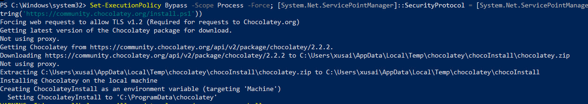{ #fig:001 width=70% }

# Установка pandoc

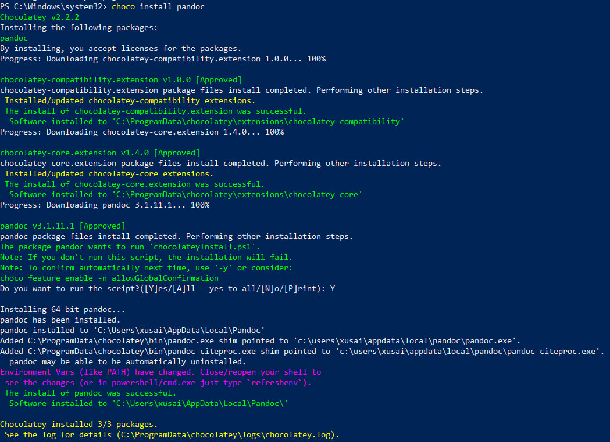{ #fig:002 width=70% }

# Создание рабочего пространства по предмету следующей иерархии.

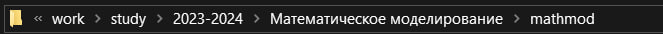{ #fig:003 width=70% }

# Установка make.

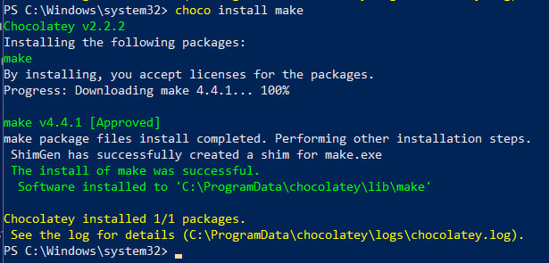{ #fig:004 width=70% }

# Установка git.

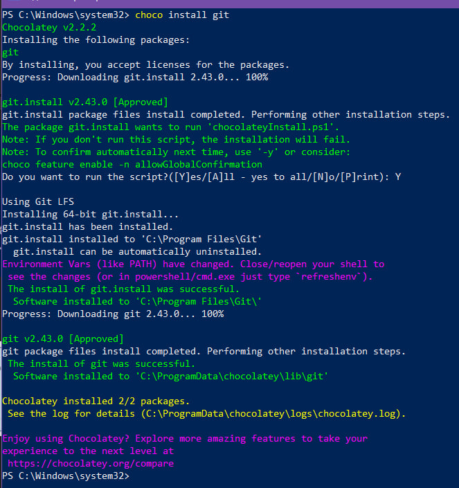{ #fig:005 width=70% }

# Установка gh (рис. [-@fig:006]).

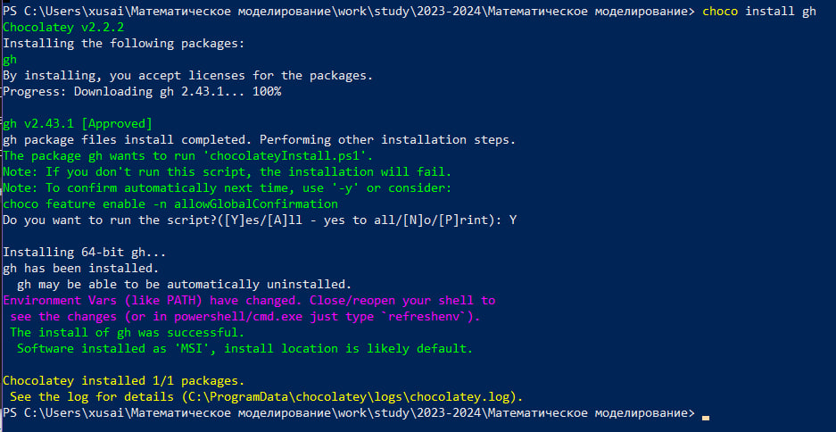{ #fig:006 width=70% }

# Создание репозитория курса с помощью утилит 

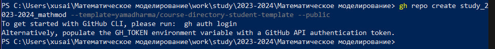{ #fig:007 width=70% }

# Ввод кода (рис. [-@fig:008]).

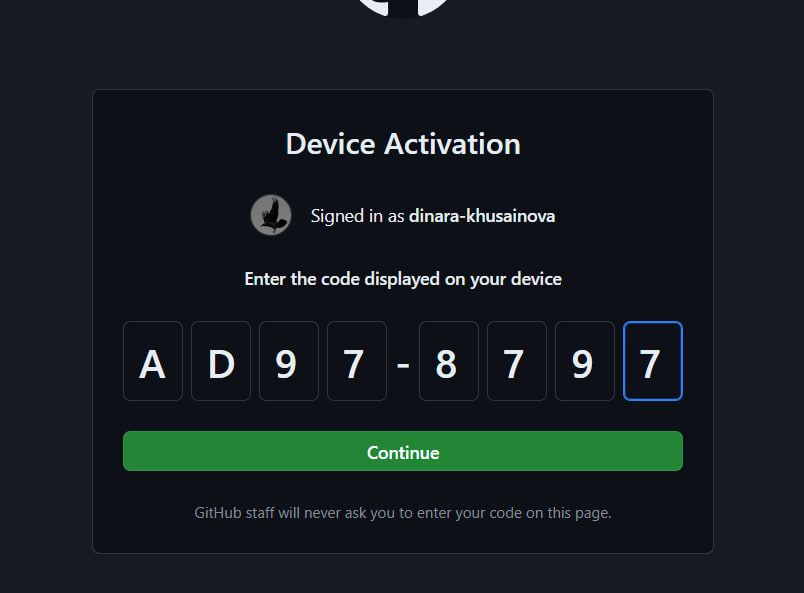{ #fig:008 width=70% }

# Создание репозитория курса с помощью gh repo create 

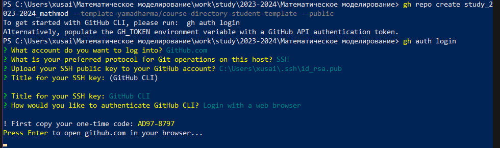{ #fig:009 width=70% }

# Создание репозитория курса с помощью gh repo create

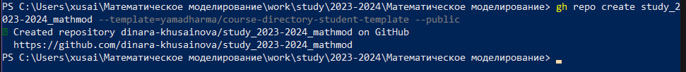{ #fig:010 width=70% }

# git clone 

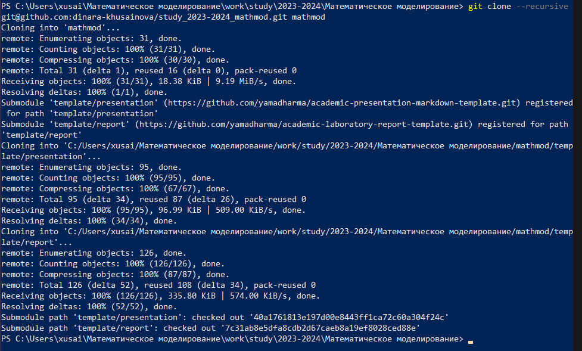{ #fig:011 width=70% }

# Результат создания на Github 

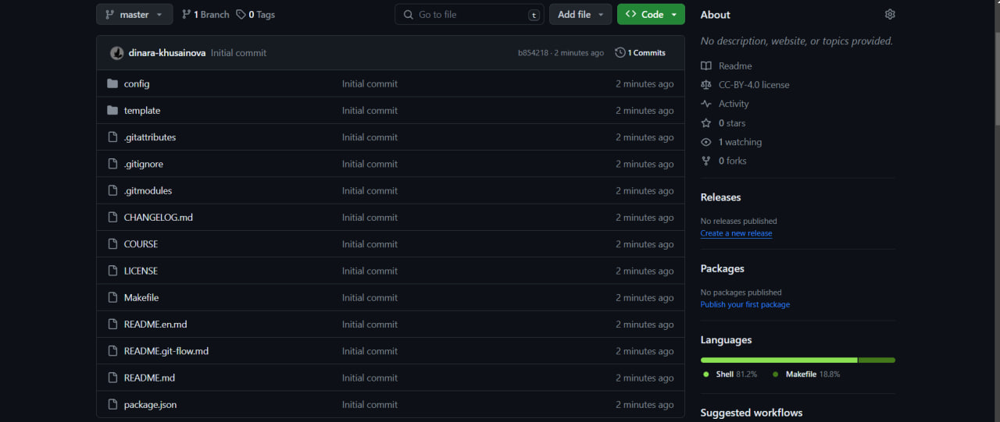{ #fig:012 width=70% }

# Папки на локальном компьютере

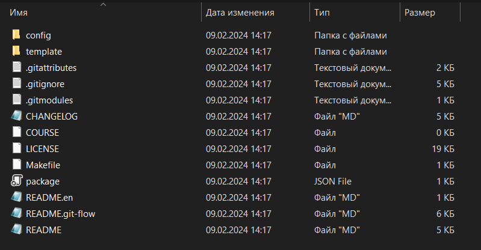{ #fig:013 width=70% }

# Установка msys2 

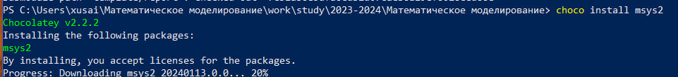{ #fig:014 width=70% }

# Удаление ненужных файлов 

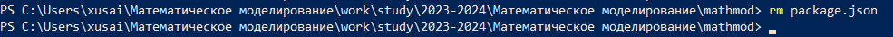{ #fig:015 width=70% }

# Заходим в msys2 и переходим в папку mathmod 

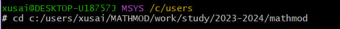{ #fig:016 width=70% }

#  Через pacman скачивание make

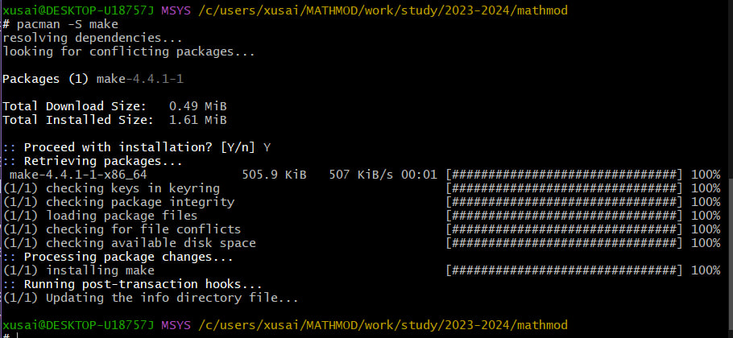{ #fig:017 width=70% }

# Выполняем make prepare 

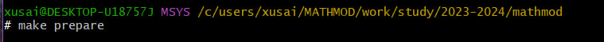{ #fig:018 width=70% }

# Отправление изменений на github 

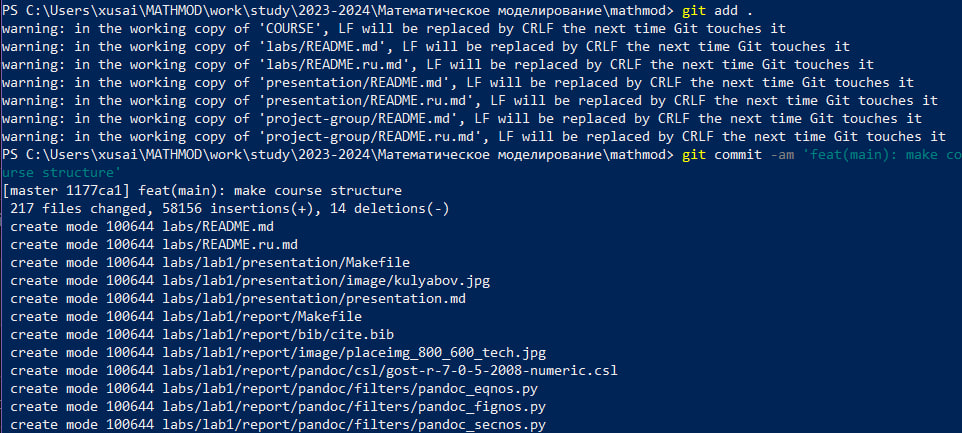{ #fig:019 width=70% }

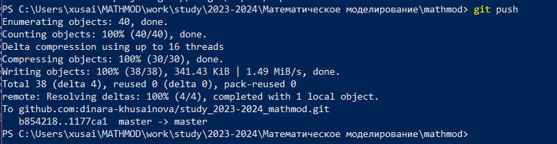{ #fig:020 width=70% }

# Обзор изменений на github

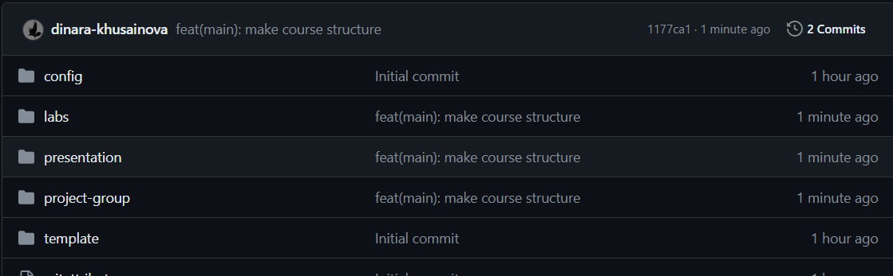{ #fig:021 width=70% }

# Обзор изменений на github

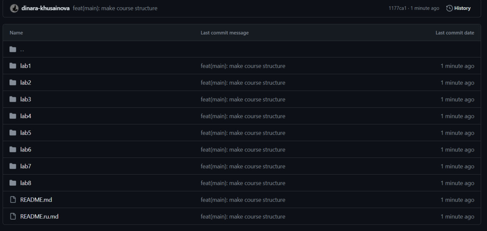{ #fig:022 width=70% }

# Скачивание MiKTeX 

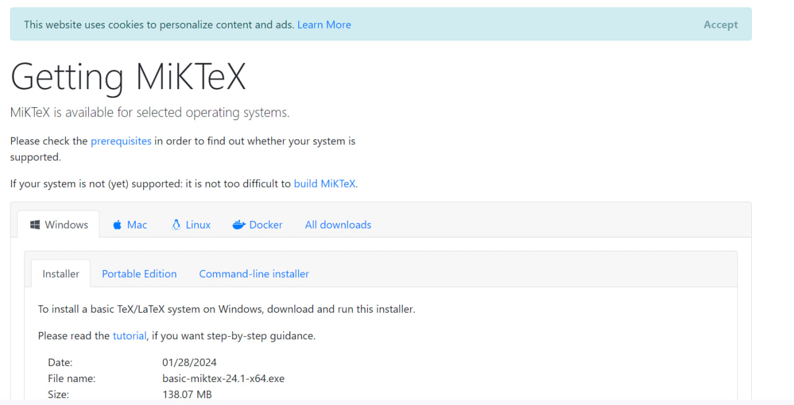{ #fig:023 width=70% }

# Конвертация в pdf 

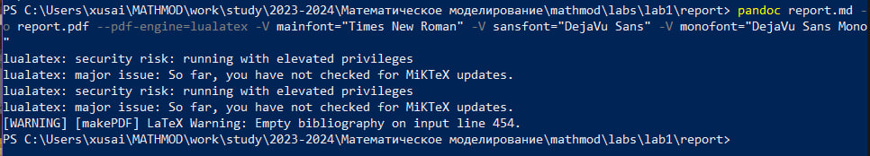{ #fig:024 width=70% }

# Конвертация в docx 

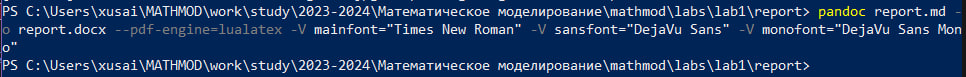{ #fig:025 width=70% }

# Готовые файлы в папке report 

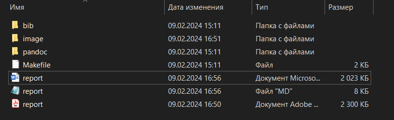{ #fig:026 width=70% }

# Выводы

Настроили рабочее пространство для лабораторной работы. Изучили систему контроля версий Git и язык разметки Markdown.
