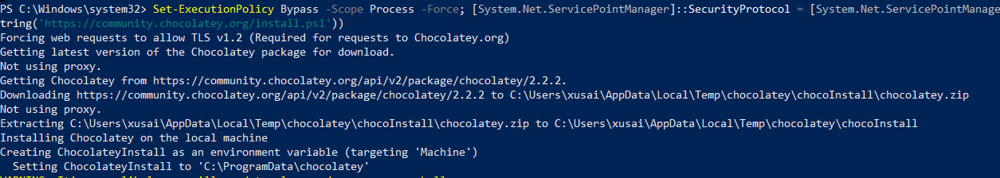

---
## Front matter
title: "Отчёт по лабораторной работе №1"
subtitle: "Подготовка рабочего пространства"
author: "Хусаинова Динара Айратовна"

## Generic otions
lang: ru-RU
toc-title: "Содержание"

## Bibliography
bibliography: bib/cite.bib
csl: pandoc/csl/gost-r-7-0-5-2008-numeric.csl

## Pdf output format
toc: true # Table of contents
toc-depth: 2
lof: true # List of figures
#lot: true # List of tables
fontsize: 12pt
linestretch: 1.5
papersize: a4
documentclass: scrreprt
## I18n polyglossia
polyglossia-lang:
  name: russian
  options:
	- spelling=modern
	- babelshorthands=true
polyglossia-otherlangs:
  name: english
## I18n babel
babel-lang: russian
babel-otherlangs: english
## Fonts
mainfont: PT Serif
romanfont: PT Serif
sansfont: PT Sans
monofont: PT Mono
mainfontoptions: Ligatures=TeX
romanfontoptions: Ligatures=TeX
sansfontoptions: Ligatures=TeX,Scale=MatchLowercase
monofontoptions: Scale=MatchLowercase,Scale=0.9
## Biblatex
biblatex: true
biblio-style: "gost-numeric"
biblatexoptions:
  - parentracker=true
  - backend=biber
  - hyperref=auto
  - language=auto
  - autolang=other*
  - citestyle=gost-numeric
## Pandoc-crossref LaTeX customization
figureTitle: "Рис."
tableTitle: "Таблица"
listingTitle: "Листинг"
lofTitle: "Список иллюстраций"
lotTitle: "Список таблиц"
lolTitle: "Листинги"
## Misc options
indent: true
header-includes:
  - \usepackage{indentfirst}
  - \usepackage{float} # keep figures where there are in the text
  - \floatplacement{figure}{H} # keep figures where there are in the text
---

# Цель работы

 Настроить рабочее пространство для лабораторной работы. Изучить систему контроля версий Git и язык разметки Markdown.

# Задание

- создать репозиторий
- настроить связь между своим компьютером и GitHub по SSH-ключу
- при помощи Makefile сконвертировать из файла .md файлы отчетов в форматах docx и pdf
- запушить все готовые отчеты на Github.

# Теоретическое введение

## Git
Git — это распределенная система управления версиями, которая означает, что локальный клон проекта — это полный репозиторий управления версиями. Полнофункциональные локальные репозитории упрощают работу как в автономном, так и в удаленном режиме. Разработчики фиксируют свою работу локально, а затем синхронизируют копию репозитория с копией на сервере.

## Markdown
Markdown — это облегченный язык разметки с синтаксисом форматирования обычного текста. Документация поддерживает разметку Markdown в соответствии с. CommonMark и ее синтаксический анализ через подсистему Markdig. Документация также поддерживает пользовательские расширения Markdown, которые предоставляют более обширный контент на сайте документации.

# Выполнение лабораторной работы

1. Установка пакетного менеджера chocolatey (рис. [-@fig:001]).

{ #fig:001 width=70% }

2. Установка pandoc (рис. [-@fig:002]).
 
{ #fig:002 width=70% }

3. Создание рабочего пространства по предмету следующей иерархии (рис. [-@fig:003]).

{ #fig:003 width=70% }

4. Установка make (рис. [-@fig:004]).

{ #fig:004 width=70% }

5. Установка git (рис. [-@fig:005]).

{ #fig:005 width=70% }

6. Установка gh (рис. [-@fig:006]).

{ #fig:006 width=70% }

7. Создание репозитория курса с помощью утилит (рис. [-@fig:007]).

{ #fig:007 width=70% }

8. Ввод кода (рис. [-@fig:008]).

{ #fig:008 width=70% }

9. Создание репозитория курса с помощью gh repo create (рис. [-@fig:009]-[-@fig:010]).

{ #fig:009 width=70% }

{ #fig:010 width=70% }

10. git clone (рис. [-@fig:011]).

{ #fig:011 width=70% }

11. Результат создания на Github (рис. [-@fig:012]).

{ #fig:012 width=70% }

12. Папки на локальном компьютере (рис. [-@fig:013]).

{ #fig:013 width=70% }

13. Установка msys2 (рис. [-@fig:014]).

{ #fig:014 width=70% }

14. Удаление ненужных файлов (рис. [-@fig:015]).

{ #fig:015 width=70% }

15. Заходим в msys2 и переходим в папку mathmod (рис. [-@fig:016]).

{ #fig:016 width=70% }

16.  Через pacman скачивание make (рис. [-@fig:017]).

{ #fig:017 width=70% }

17. Выполняем make prepare (рис. [-@fig:018]).

{ #fig:018 width=70% }

18. Отправление изменений на github (рис. [-@fig:019]-[-@fig:020]).

{ #fig:019 width=70% }

{ #fig:020 width=70% }

19. Обзор изменений на github (рис. [-@fig:021]-[-@fig:022]).

{ #fig:021 width=70% }

{ #fig:022 width=70% }

20. Скачивание MiKTeX (рис. [-@fig:023]).

{ #fig:023 width=70% }

21. Конвертация в pdf  (рис. [-@fig:024]).

{ #fig:024 width=70% }

21. Конвертация в docx (рис. [-@fig:025]).

{ #fig:025 width=70% }

22. Готовые файлы в папке report (рис. [-@fig:026]).

{ #fig:026 width=70% }

# Выводы

Настроили рабочее пространство для лабораторной работы. Изучили систему контроля версий Git и язык разметки Markdown.

