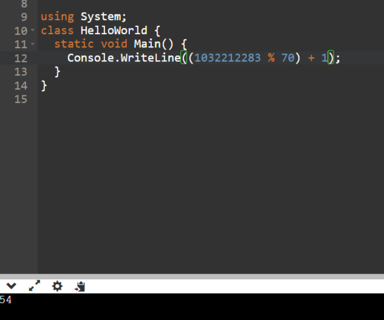
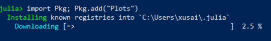

---
## Front matter
lang: ru-RU
title: "Презентация по лабораторной работе №2"
subtitle: "Задача о погоне"
author:
  - Хусаинова Д.А.
institute:
  - Российский университет дружбы народов, Москва, Россия
date: 16 февраля 2024

## i18n babel
babel-lang: russian 
babel-otherlangs: english 
mainfont: Arial 
monofont: Courier New 
fontsize: 12pt

## Formatting pdf
toc: false
toc-title: Содержание
slide_level: 2
aspectratio: 169
section-titles: true
theme: metropolis
header-includes:
 - \metroset{progressbar=frametitle,sectionpage=progressbar,numbering=fraction}
 - '\makeatletter'
 - '\beamer@ignorenonframefalse'
 - '\makeatother'
---

# Цель работы

  Изучить основы языка программирования Julia

# Задание

- Изучить основы языков программирования Julia
- Освоить библиотеки этих языков, которые используются для построения графиков и решения дифференциальных уравнений
-  Решить задачу о погоне. 

# Расчет своего варианта 

{ #fig:001 width=70% }

# Решение задачи 

$$ t = {{x }\over{v}} $$
$$ t = {{17,7-x}\over{3,8 v}} $$
$$ t = {{17,7+x}\over{3,8 v}} $$

# Решение задачи

Из этих уравнений получаем объедиение двух уравнений:

$$ \left[ \begin{array}{cl}
{{x}\over{v}} = {{17,7-x}\over{3,8 v}}\\
{{x}\over{v}} = {{17,7+x}\over{3,8 v}}
\end{array} \right. $$

# Решение задачи
Решая это, получаем два значения для x:
$$ x1 = {{14,0125}} $$
$$ x2 = {{24,0214}} $$

# Решение задачи
$$ v_\tau  $$ – тангенциальная скорость
$$ v $$ – радиальная скорость
$$ v = {dr\over dt} $$
$$ v_\tau = {{\sqrt{((3,8*v)^2-v^2)}}} = {\sqrt{70}*v \over{5}}   $$

# Решение задачи
$$ \left\{ \begin{array}{cl}
{dr\over dt} = v \\
r{d\theta\over dt} = {\sqrt{70}*v \over{5}} 
\end{array} \right. $$

# Решение задачи

$$ \left\{ \begin{array}{cl}
\theta_0 = 0 \\
r_0 = x_1 = {{14,0125}}
\end{array} \right. $$

или

# Решение задачи

$$ \left\{ \begin{array}{cl}
\theta_0 = -\pi \\
r_0 = x_2 = {{24,0214}}
\end{array} \right. $$

# Итоговое уравнение
$$ {dr\over d\theta} = {5r\over\sqrt{70}} $$

# Моделирование с помощью Julia. Скачивание

{ #fig:005 width=70% }

# Создаем файл lab2.jl и запускаем Julia 
{ #fig:006 width=70% }

# Запуск Julia 

{ #fig:007 width=70% }

# Скачиваем необходимые для работы пакеты b проверяем их наличие

{ #fig:008 width=70% }

# DifferentialEquations
{ #fig:009 width=70% }

# Проверяем 
{ #fig:010 width=70% }

# Запуск кода 

{ #fig:011 width=70% }

# Просмотр результата работы. Случай 1

{ #fig:011 width=70% }

# Случай 2

{ #fig:011 width=70% }

# Выводы

Были изучены основы языков программирования Julia и OpenModelica. Освоены библиотеки этих языков, которые используются для построения графиков и решения дифференциальных уравнений. Поскольку OpenModelica не работает с полярными координатами, она пока что не была использована в данной лабораторной работе. 
