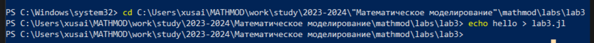
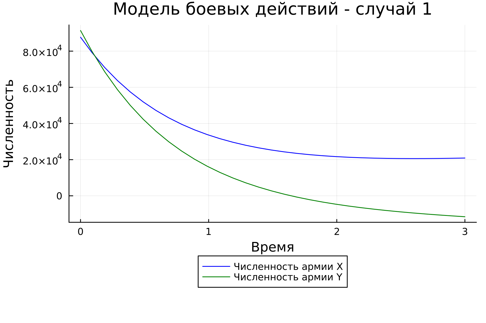
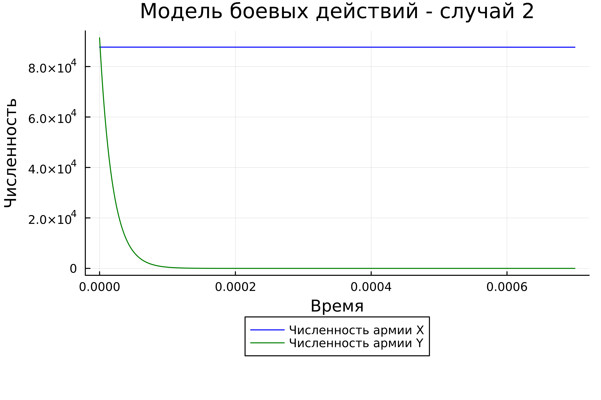
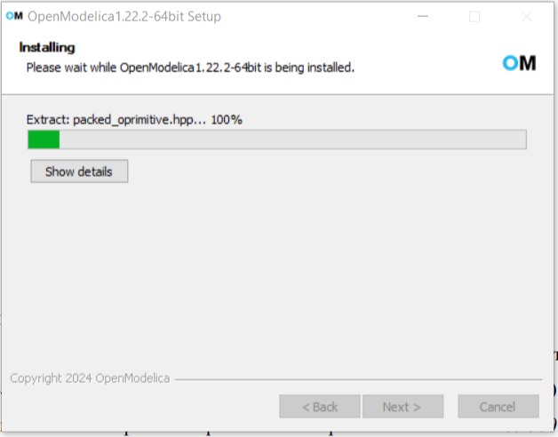
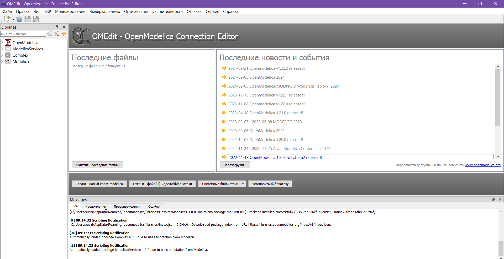
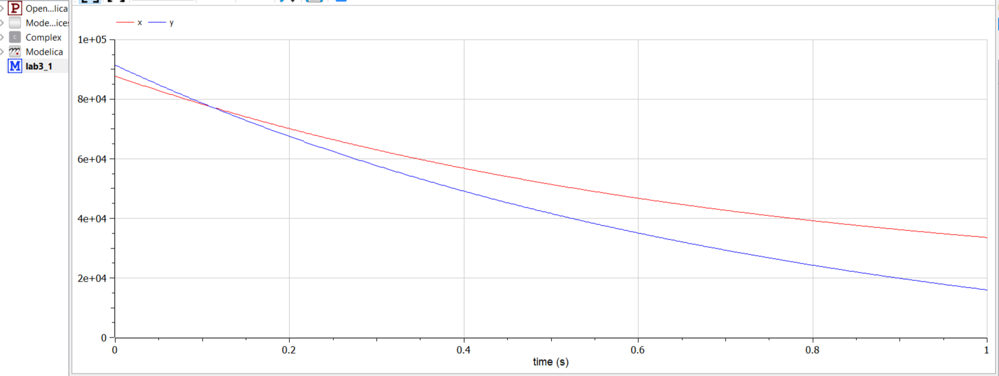
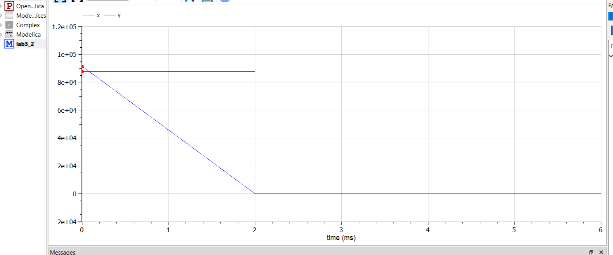

---
## Front matter
lang: ru-RU
title: "Презентация по лабораторной работе №3"
subtitle: "Модель боевых действий"
author:
  - Хусаинова Д.А.
institute:
  - Российский университет дружбы народов, Москва, Россия
date: 23 февраля 2024

## i18n babel
babel-lang: russian 
babel-otherlangs: english 
mainfont: Arial 
monofont: Courier New 
fontsize: 12pt

## Formatting pdf
toc: false
toc-title: Содержание
slide_level: 2
aspectratio: 169
section-titles: true
theme: metropolis
header-includes:
 - \metroset{progressbar=frametitle,sectionpage=progressbar,numbering=fraction}
 - '\makeatletter'
 - '\beamer@ignorenonframefalse'
 - '\makeatother'
---


# Цель работы

  Изучить модели боевых действий Ланчестера. Применить их на практике для решения задания лабораторной работы, использовав Julia и OpenModelica.

# Регулярная армия X против регулярной армии Y

$$ {dx\over {dt}} = -a(t)x(t)-b(t)y(t)+P(t) $$
$$ {dy\over {dt}} = -c(t)x(t)-h(t)y(t)+Q(t) $$

# Регулярная армия против партизанской армии


$$ {dx\over {dt}} = -a(t)x(t)-b(t)y(t)+P(t) $$
$$ {dy\over {dt}} = -c(t)x(t)y(t)-h(t)y(t)+Q(t) $$

# Решение с помощью программ. Julia

{ #fig:001 width=70% }


# Код программы Julia

```
using Plots;

using DifferentialEquations;

function first(du, u, p, t)
	du[1] = - 0.354*u[1] - 0.765*u[2] + abs(sin(t + 10))
	du[2] = - 0.679*u[1] - 0.845*u[2] + abs(cos(t + 15))
end

function second(du, u, p, t)
	du[1] = - 0.505*u[1] - 0.77*u[2] + sin(2*t)+2
	du[2] = - 0.6*u[1]*u[2] - 0.404*u[2] + cos(5*t)+2
end

const people = Float64[87700, 91400]
const prom1 = [0.0, 3.0]
const prom2 = [0.0, 0.0007]
```
# Код программы Julia

```
prob1 = ODEProblem(first, people, prom1)
prob2 = ODEProblem(second, people, prom2)

sol1 = solve(prob1, dtmax=0.1)
sol2 = solve(prob2, dtmax=0.000001)

A1 = [u[1] for u in sol1.u]
A2 = [u[2] for u in sol1.u]
T1 = [t for t in sol1.t]
A3 = [u[1] for u in sol2.u]
A4 = [u[2] for u in sol2.u]
T2 = [t for t in sol2.t]
```

# Код программы Julia

```
plt1 = plot(dpi = 300, legend= true, bg =:white)
plot!(plt1, xlabel="Время", ylabel="Численность", title="Модель боевых действий - случай 1", legend=:outerbottom)
plot!(plt1, T1, A1, label="Численность армии X", color =:blue)
plot!(plt1, T1, A2, label="Численность армии Y", color =:green)
savefig(plt1, "lab03_1.png")
```


# Код программы Julia

```
plt2 = plot(dpi = 1200, legend= true, bg =:white)
plot!(plt2, xlabel="Время", ylabel="Численность", title="Модель боевых действий - случай 2", legend=:outerbottom)
plot!(plt2, T2, A3, label="Численность армии X", color =:blue)
plot!(plt2, T2, A4, label="Численность армии Y", color =:green)
savefig(plt2, "lab03_2.png")
```

# Запуск

{ #fig:002 width=70% }

# Результат работы с Julia. График для первого случая

{ #fig:003 width=70% }

# График для второго случая 

{ #fig:003 width=70% }

# OpenModelica

Скачаем OpenModelica 

{ #fig:002 width=70% }

# Откроем OpenModelica и создадим модель для первого случая

{ #fig:002 width=70% }

# Код для первого случая

```
model lab3_1
Real x;
Real y;
Real a = 0.354;
Real b = 0.765;
Real c = 0.679;
Real h = 0.845;
Real t = time;
initial equation
x = 87700;
y = 91400;
equation
der(x)=-a*x - b*y +abs(sin(t+10));
der(y)=-c*x - h*y +abs(cos(t+15));
end lab3_1;
```

# Код для второго случая
```
model lab3_2
Real x;
Real y;
Real a = 0.505;
Real b = 0.77;
Real c = 0.6;
Real h = 0.404;
Real t = time;
initial equation
x = 87700;
y = 91400;
equation
der(x)=-a*x - b*y +sin(2*t) + 2;
der(y)=-c*x*y - h*y +cos(5*t) + 2;
end lab3_2;

```

# Результат работы OpenModelica для модели боевых действий между регулярными войсками

{ #fig:003 width=70% }


# Результат работы OpenModelica для модели боевых действий между регулярной армией и партизанской армией 

{ #fig:003 width=70% }

# Выводы

По итогам лабораторной работы я построила по две модели на языках Julia и OpenModelica. В ходе проделанной работы можно сделать вывод, что OpenModelica лучше приспособлен для моделирование процессов, протекающих во времени. Построение моделей боевых действий на языке OpenModelica занимает гораздо меньше строк и времени, чем аналогичное построение на языке Julia.