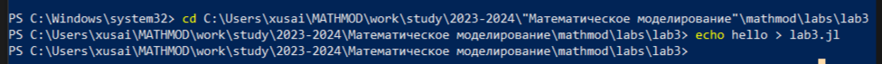
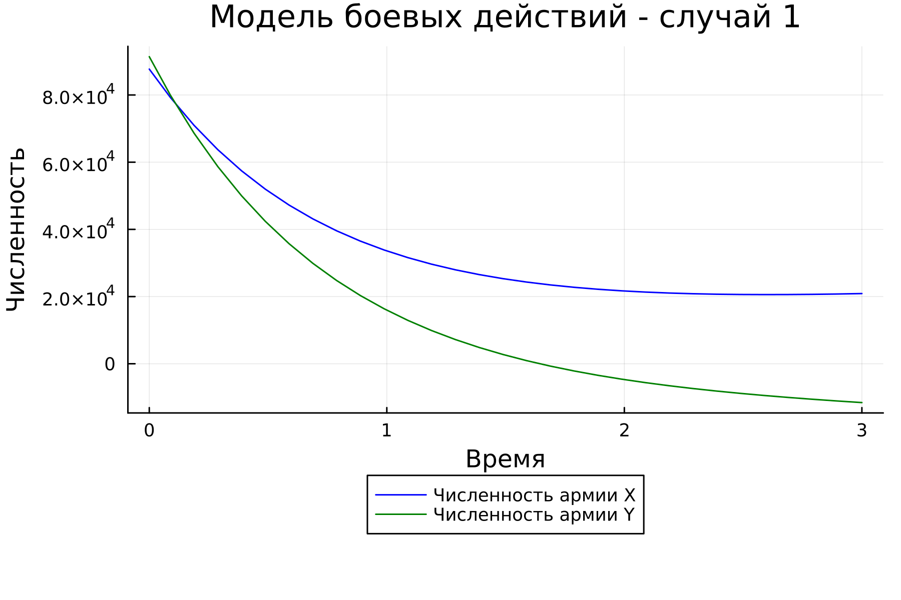
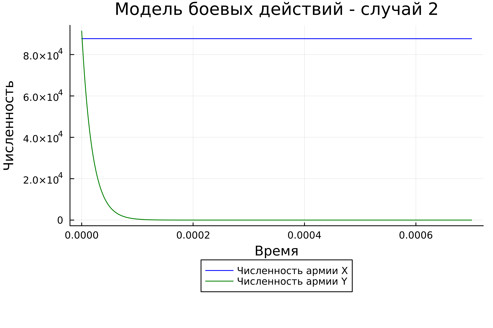
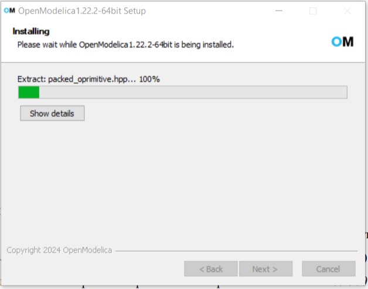
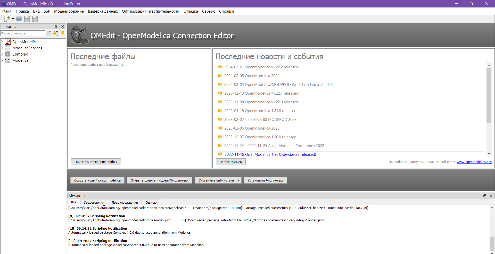
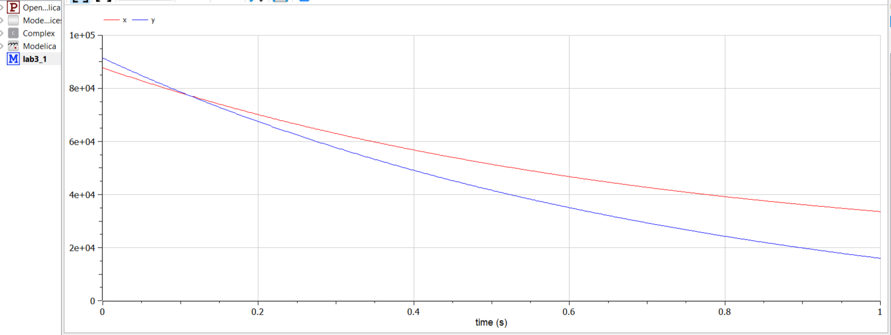
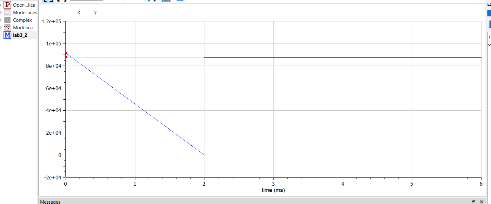

---
## Front matter
title: "Отчет по лабораторной работе № 3"
subtitle: "Модель боевых действий"
author: "Хусаинова Динара Айратовна"


## Generic otions
lang: ru-RU
toc-title: "Содержание"

## Bibliography
bibliography: bib/cite.bib
csl: pandoc/csl/gost-r-7-0-5-2008-numeric.csl

## Pdf output format
toc: true # Table of contents
toc-depth: 2
lof: true # List of figures
#lot: true # List of tables
fontsize: 12pt
linestretch: 1.5
papersize: a4
documentclass: scrreprt
## I18n polyglossia
polyglossia-lang:
  name: russian
  options:
	- spelling=modern
	- babelshorthands=true
polyglossia-otherlangs:
  name: english
## I18n babel
babel-lang: russian
babel-otherlangs: english
## Fonts
mainfont: PT Serif
romanfont: PT Serif
sansfont: PT Sans
monofont: PT Mono
mainfontoptions: Ligatures=TeX
romanfontoptions: Ligatures=TeX
sansfontoptions: Ligatures=TeX,Scale=MatchLowercase
monofontoptions: Scale=MatchLowercase,Scale=0.9
## Biblatex
biblatex: true
biblio-style: "gost-numeric"
biblatexoptions:
  - parentracker=true
  - backend=biber
  - hyperref=auto
  - language=auto
  - autolang=other*
  - citestyle=gost-numeric
## Pandoc-crossref LaTeX customization
figureTitle: "Рис."
tableTitle: "Таблица"
listingTitle: "Листинг"
lofTitle: "Список иллюстраций"
lotTitle: "Список таблиц"
lolTitle: "Листинги"
## Misc options
indent: true
header-includes:
  - \usepackage{indentfirst}
  - \usepackage{float} # keep figures where there are in the text
  - \floatplacement{figure}{H} # keep figures where there are in the text
---

# Цель работы

Изучить модели боевых действий Ланчестера. Применить их на практике для решения задания лабораторной работы, использовав Julia и OpenModelica.

# Задание

- Построить графики изменения численности войск армии Х и армии У для
следующих случаев:
1) Модель боевых действий между регулярными войсками
2) Модель ведение боевых действий с участием регулярных войск и
партизанских отрядов 

# Теоретическое введение

Законы Ланчестера (законы Осипова — Ланчестера) — математическая формула для расчета относительных сил пары сражающихся сторон — подразделений вооруженных сил

Уравнения Ланчестера — это дифференциальные уравнения, описывающие зависимость между силами сражающихся сторон A и D как функцию от времени, причем функция зависит только от A и D.

В 1916 году, в разгар первой мировой войны, Фредерик Ланчестер разработал систему дифференциальных уравнений для демонстрации соотношения между противостоящими силами. Среди них есть так называемые Линейные законы Ланчестера (первого рода или честного боя, для рукопашного боя или неприцельного огня) и Квадратичные законы Ланчестера (для войн начиная с XX века с применением прицельного огня, дальнобойных орудий, огнестрельного оружия). В связи с установленным приоритетом в англоязычной литературе наметилась тенденция перехода от фразы «модель Ланчестера» к «модели Осипова — Ланчестера». [4]

В противоборстве могут принимать участие как регулярные войска, так и партизанские отряды. В общем случае главной характеристикой соперников являются численности сторон. Если в какой-то момент времени одна из численностей обращается в нуль, то данная сторона считается проигравшей (при условии, что численность другой стороны в данный момент положительна).
Рассмотривается три случая ведения боевых действий:

Боевые действия между регулярными войсками

Боевые действия с участием регулярных войск и партизанских отрядов

Боевые действия между партизанскими отрядами

# Выполнение лабораторной работы

1. Регулярная армия X против регулярной армии Y
Рассмотрим первый случай. Численность регулярных войск определяется тремя факторами:

Cкорость уменьшения численности войск из-за причин, не связанных с боевыми действиями (болезни, травмы, дезертирство);
Cкорость потерь, обусловленных боевыми действиями противоборствующих сторон (что связанно с качеством стратегии, уровнем вооружения, профессионализмом солдат и т.п.);
Cкорость поступления подкрепления (задаётся некоторой функцией от времени).
В этом случае модель боевых действий между регулярными войсками описывается следующим образом:

$$ {dx\over {dt}} = -a(t)x(t)-b(t)y(t)+P(t) $$
$$ {dy\over {dt}} = -c(t)x(t)-h(t)y(t)+Q(t) $$

В первом пункте нами рассматривается как раз такая модель. Она является доработанной моделью Ланчестера, так его изначальная модель учитывала лишь члены $b(t)y(t)$ и $c(t)x(t)$, то есть, на потери за промежуток времени влияли лишь численность армий и "эффективность оружия" (коэффициенты $b(t)$ и $c(t)$).

$$ {dx\over {dt}} = -ax(t)-by(t)+P(t) $$
$$ {dy\over {dt}} = -cx(t)-hy(t)+Q(t) $$
Регулярная армия X против партизанской армии Y

Для второй части задания, то есть, для моделирования боевых действий между регулярной армией и партизанской армией, необходимо внести поправки в предыдущую модель. Считается, что темп потерь партизан, проводящих свои операции в разных местах на некоторой известной территории, пропорционален не только численности армейских соединений, но и численности самих партизан.

$$ {dx\over {dt}} = -a(t)x(t)-b(t)y(t)+P(t) $$
$$ {dy\over {dt}} = -c(t)x(t)y(t)-h(t)y(t)+Q(t) $$

Коэффициенты $a$, $b$, $c$ и $h$ всё так же будут положительными десятичными числами:

$$ {dx\over {dt}} = -ax(t)-by(t)+P(t) $$
$$ {dy\over {dt}} = -cx(t)y(t)-hy(t)+Q(t) $$

## Решение с помощью программ

### Julia

2. Создадим файл lab3.jl (рис. 1). 

{ #fig:001 width=70% }

3. Код программы:
```
using Plots;

using DifferentialEquations;

function first(du, u, p, t)
	du[1] = - 0.354*u[1] - 0.765*u[2] + abs(sin(t + 10))
	du[2] = - 0.679*u[1] - 0.845*u[2] + abs(cos(t + 15))
end

function second(du, u, p, t)
	du[1] = - 0.505*u[1] - 0.77*u[2] + sin(2*t)+2
	du[2] = - 0.6*u[1]*u[2] - 0.404*u[2] + cos(5*t)+2
end

const people = Float64[87700, 91400]
const prom1 = [0.0, 3.0]
const prom2 = [0.0, 0.0007]

prob1 = ODEProblem(first, people, prom1)
prob2 = ODEProblem(second, people, prom2)

sol1 = solve(prob1, dtmax=0.1)
sol2 = solve(prob2, dtmax=0.000001)

A1 = [u[1] for u in sol1.u]
A2 = [u[2] for u in sol1.u]
T1 = [t for t in sol1.t]
A3 = [u[1] for u in sol2.u]
A4 = [u[2] for u in sol2.u]
T2 = [t for t in sol2.t]

plt1 = plot(dpi = 300, legend= true, bg =:white)
plot!(plt1, xlabel="Время", ylabel="Численность", title="Модель боевых действий - случай 1", legend=:outerbottom)
plot!(plt1, T1, A1, label="Численность армии X", color =:blue)
plot!(plt1, T1, A2, label="Численность армии Y", color =:green)
savefig(plt1, "lab03_1.png")

plt2 = plot(dpi = 1200, legend= true, bg =:white)
plot!(plt2, xlabel="Время", ylabel="Численность", title="Модель боевых действий - случай 2", legend=:outerbottom)
plot!(plt2, T2, A3, label="Численность армии X", color =:blue)
plot!(plt2, T2, A4, label="Численность армии Y", color =:green)
savefig(plt2, "lab03_2.png")
```

4. Запуск julia (рис. 2).

{ #fig:002 width=70% }

5. Результат работы с Julia. График для первого случая ( рис. 3). 

{ #fig:003 width=70% }

6. График для второго случая (рис. 4).

{ #fig:003 width=70% }


### OpenModelica

7. Скачаем OpenModelica (рис. 5). 

{ #fig:002 width=70% }

8. Откроем OpenModelica и создадим модель для первого случая( рис. 6). 

{ #fig:002 width=70% }

Код для первого случая: 

```
model lab3_1
Real x;
Real y;
Real a = 0.354;
Real b = 0.765;
Real c = 0.679;
Real h = 0.845;
Real t = time;
initial equation
x = 87700;
y = 91400;
equation
der(x)=-a*x - b*y +abs(sin(t+10));
der(y)=-c*x - h*y +abs(cos(t+15));
end lab3_1;
```

Код для второго случая:
```
model lab3_2
Real x;
Real y;
Real a = 0.505;
Real b = 0.77;
Real c = 0.6;
Real h = 0.404;
Real t = time;
initial equation
x = 87700;
y = 91400;
equation
der(x)=-a*x - b*y +sin(2*t) + 2;
der(y)=-c*x*y - h*y +cos(5*t) + 2;
end lab3_2;

```

9. Результат работы OpenModelica для модели боевых действий между регулярными войсками (рис. 7).

{ #fig:003 width=70% }

10. Результат работы OpenModelica для модели боевых действий между регулярной армией и партизанской армией (рис. 8).

{ #fig:003 width=70% }

# Выводы

По итогам лабораторной работы я построила по две модели на языках Julia и OpenModelica. В ходе проделанной работы можно сделать вывод, что OpenModelica лучше приспособлен для моделирование процессов, протекающих во времени. Построение моделей боевых действий на языке OpenModelica занимает гораздо меньше строк и времени, чем аналогичное построение на языке Julia.


# Список литературы 

[1] Документация по Julia: https://docs.julialang.org/en/v1/

[2] Документация по OpenModelica: https://openmodelica.org/