---
## Front matter
lang: ru-RU
title: "Презентация по лабораторной работе №4"
subtitle: "Модель гармонических колебаний"
author:
  - Хусаинова Д.А.
institute:
  - Российский университет дружбы народов, Москва, Россия
date: 1 марта 2024

## i18n babel
babel-lang: russian 
babel-otherlangs: english 
mainfont: Arial 
monofont: Courier New 
fontsize: 12pt

## Formatting pdf
toc: false
toc-title: Содержание
slide_level: 2
aspectratio: 169
section-titles: true
theme: metropolis
header-includes:
 - \metroset{progressbar=frametitle,sectionpage=progressbar,numbering=fraction}
 - '\makeatletter'
 - '\beamer@ignorenonframefalse'
 - '\makeatother'
---


# Цель работы

  Изучить понятие гармонического осциллятора, построить фазовый портрет и найти решение уравнения гармонического осциллятора.

# Теоретическое введение

- Гармонический осциллятор — система, которая при смещении из положения равновесия испытывает действие возвращающей силы F, пропорциональной смещению x.

- Гармоническое колебание - колебание, в процессе которого величины, характеризующие движение (смещение, скорость, ускорение и др.), изменяются по закону синуса или косинуса (гармоническому закону).

# Уравнение свободных колебаний гармонического осциллятора

$$\ddot{x}+2\gamma\dot{x}+\omega_0^2=0$$
где $x$ - переменная, описывающая состояние системы (смещение грузика, заряд конденсатора и т.д.), $\gamma$ - параметр, характеризующий потери энергии (трение в механической системе, сопротивление в контуре), $\omega_0$ - собственная частота колебаний.
Это уравнение есть линейное однородное дифференциальное  уравнение второго порядка и оно является примером линейной динамической системы.

# Для однозначной разрешимости уравнения второго порядка необходимо задать два начальных условия вида
 $$
 \begin{cases}
	x(t_0)=x_0
	\\   
	\dot{x(t_0)}=y_0
 \end{cases}
$$

# Уравнение второго порядка можно представить в виде системы двух уравнений первого порядка:
$$
 \begin{cases}
	x=y
	\\   
	y=-\omega_0^2x
 \end{cases}
$$

# Начальные условия для системы примут вид:
$$
 \begin{cases}
	x(t_0)=x_0
	\\   
	y(t_0)=y_0
 \end{cases}
$$

# Задачи

1. Разобраться в понятии гармонического осциллятора

2. Ознакомиться с уравнением свободных колебаний гармонического осциллятора

3. Построить фазовый портрет гармонического осциллятора и решение уравнения на языках Julia и Open Modelica гармонического осциллятора для следующих случаев:

# Вариант № 54

Постройте фазовый портрет гармонического осциллятора и решение уравнения
гармонического осциллятора для следующих случаев

Колебания гармонического осциллятора без затуханий и без действий внешней
силы $\ddot{x}+9.9x=0$;

# Вариант № 54 

Колебания гармонического осциллятора c затуханием и без действий внешней
силы $\ddot{x}+\dot{13x}+13x=0$


Колебания гармонического осциллятора c затуханием и под действием внешней
силы $\ddot{x}+\dot{24x}+25x=6sin(4t)$

# Вариант № 54 
На интервале $t\in [0;48]$ (шаг $0.05$) с начальными условиями $x_0=0.9, y_0=0.9$.

# Julia

Создадим файлы lab4_1.jl, lab4_2.jl, lab4_3.jl 

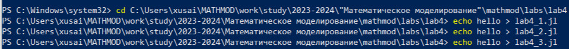{ #fig:001 width=70% }

# Первый случай

```
using DifferentialEquations
function lorenz!(du, u, p, t)
	a = p
	du[1] = u[2]
	du[2] = -a*u[1]
end
const x = 0.9
const y = 0.9
u0 = [x,y]
p = (9.9)
tspan = (0.0, 48.0)
prob = ODEProblem(lorenz!, u0, tspan, p)
sol = solve(prob, dtmax = 0.05)
using Plots; gr()
# решение системы уравнений
plot(sol) 
savefig("lab4_1_jl.png")
# фазовый портрет
plot(sol, vars=(2,1))
savefig("lab4_1_jl_port.png")
```

# Второй случай

```
using DifferentialEquations
function lorenz!(du, u, p, t)
    a, b = p
    du[1] = u[2]
    du[2] = -a*du[1] - b*u[1] 
end
const x = 0.9
const y = 0.9
u0 = [x, y]
p = (sqrt(13), 13)
tspan = (0.0, 48.0)
prob = ODEProblem(lorenz!, u0, tspan, p)
sol = solve(prob, dtmax = 0.05)
using Plots; gr()
# решение системы уравнений
plot(sol)
savefig("lab4_2_jl.png")
# фазовый портрет
plot(sol, vars=(2,1))
savefig("lab4_2_jl_port.png")
```
# Третий случай

```
using DifferentialEquations
function lorenz!(du, u, p, t)
    a, b = p
    du[1] = u[2]
    du[2] = -a*du[1] - b*u[1] + 6*sin(4*t)
end
const x = 0.9
const y = 0.9
u0 = [x, y]
p = (sqrt(24), 25)
tspan = (0.0, 48.0)
prob = ODEProblem(lorenz!, u0, tspan, p)
sol = solve(prob, dtmax = 0.05)
using Plots; gr()
#решение системы уравнений
plot(sol)
savefig("lab4_3_jl.png")
#фазовый портрет
plot(sol, vars=(2,1))
savefig("lab4_3_jl_port.png")
```

# Результат работы "Колебания гармонического осциллятора без затуханий и без действий внешней силы" 

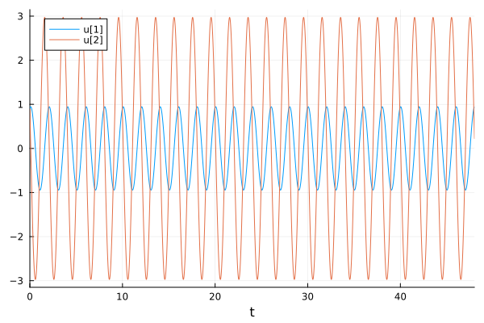{ #fig:002 width=70% }

# Результат работы "Колебания гармонического осциллятора без затуханий и без действий внешней силы" 

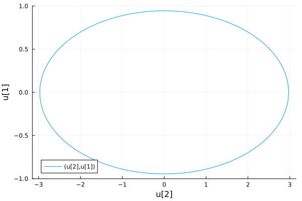{ #fig:003 width=70% }


# Результат работы "Колебания гармонического осциллятора c затуханием и без действий внешней силы" 

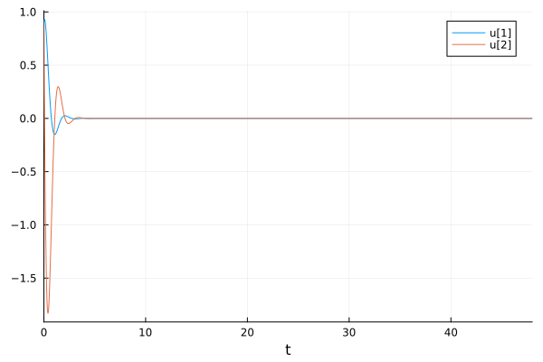{ #fig:004 width=70% }

# Результат работы "Колебания гармонического осциллятора c затуханием и без действий внешней силы" 

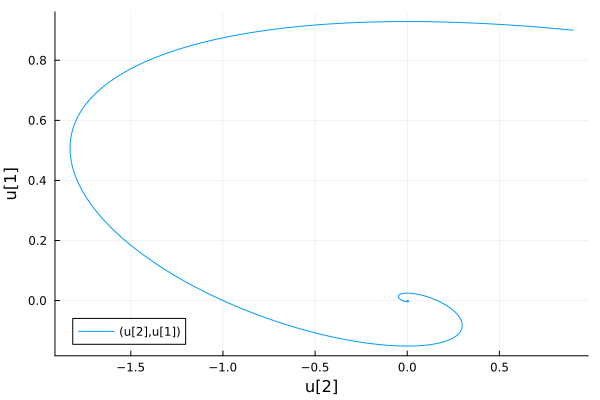{ #fig:005 width=70% }

# Результат работы "Колебания гармонического осциллятора c затуханием и под действием внешней силы" 

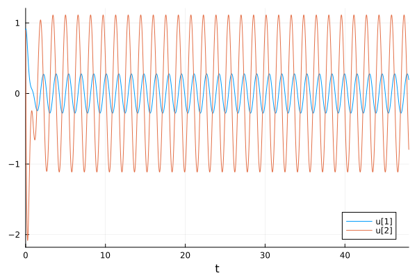{ #fig:006 width=70% }

# Результат работы "Колебания гармонического осциллятора c затуханием и под действием внешней силы" 

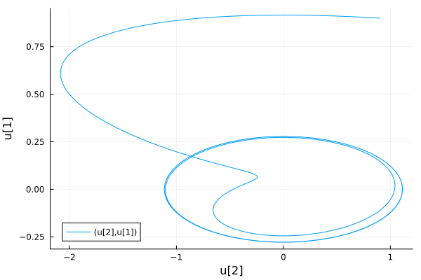{ #fig:007 width=70% }

# OpenModelica. Первый случай
```
model Lab4_1_mo
parameter Real w = sqrt(9.90);  
parameter Real g =0;  
parameter Real x0 = 0.9; 
parameter Real y0 = 0.9; 
Real x(start=x0); 
Real y(start=y0); 
function f 
input Real t ; 
output Real res; 
algorithm  
res := 0; 
end f; 
equation 
der(x) = y; 
der(y) = -w*w*x - g*y + f(time); 
end Lab4_1_mo;
```

# OpenModelica. Второй случай
```
model Lab4_2_mo
parameter Real w = sqrt(13.00);  
parameter Real g = 13;  
parameter Real x0 = 0.9; 
parameter Real y0 = 0.9; 
Real x(start=x0); 
Real y(start=y0); 
function f 
input Real t ; 
output Real res; 
algorithm  
res := 0; 
end f; 
equation 
der(x) = y; 
der(y) = -w*w*x - g*y + f(time); 
end Lab4_2_mo;
```

# OpenModelica. Третий случай
```
model Lab4_3_mo
parameter Real w = sqrt(25.0);  
parameter Real g = 24;  
parameter Real x0 = 0.9; 
parameter Real y0 = 0.9;
Real x(start=x0); 
Real y(start=y0); 
function f 
input Real t ; 
output Real res; 
algorithm  
res := 6*sin(4*t);
end f; 
equation 
der(x) = y; 
der(y) = -w*w*x - g*y - f(time); 
end Lab4_3_mo;
```

# Результат работы "Колебания гармонического осциллятора без затуханий и без действий внешней силы" 

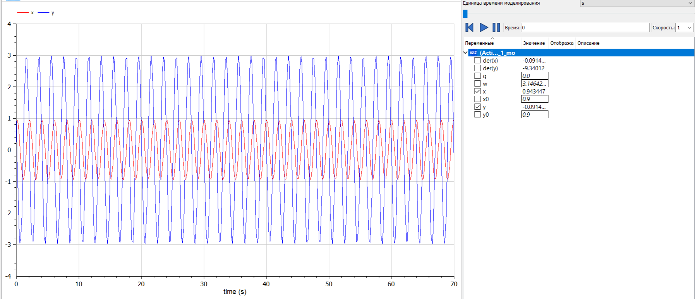{ #fig:008 width=70% }

# Результат работы "Колебания гармонического осциллятора без затуханий и без действий внешней силы" 

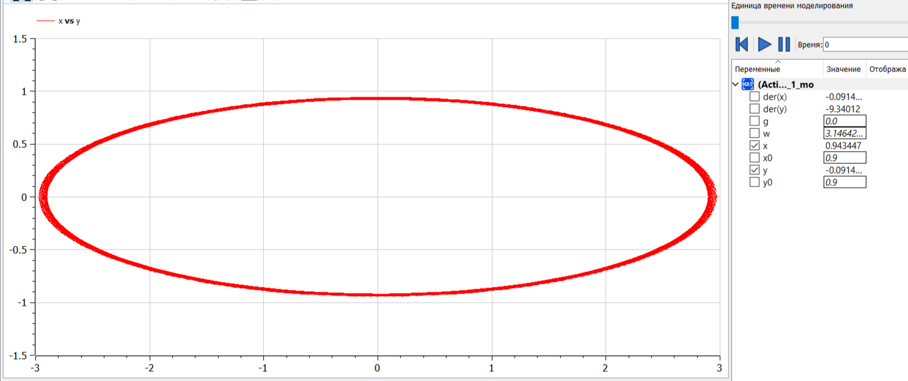{ #fig:009 width=70% }


# Результат работы "Колебания гармонического осциллятора c затуханием и без действий внешней силы" 

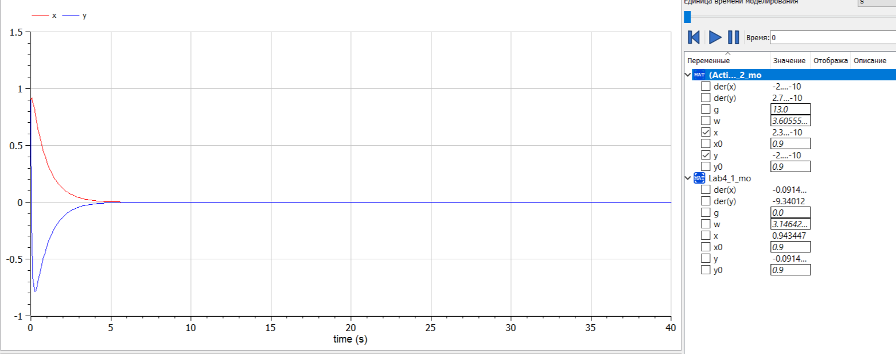{ #fig:010 width=70% }

# Результат работы "Колебания гармонического осциллятора c затуханием и без действий внешней силы" 

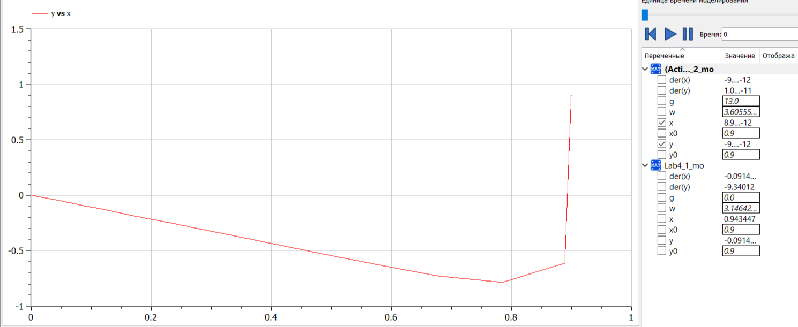{ #fig:011 width=70% }

# Результат работы "Колебания гармонического осциллятора c затуханием и под действием внешней силы" 

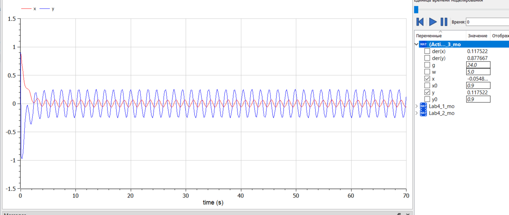{ #fig:012 width=70% }

# Результат работы "Колебания гармонического осциллятора c затуханием и под действием внешней силы"

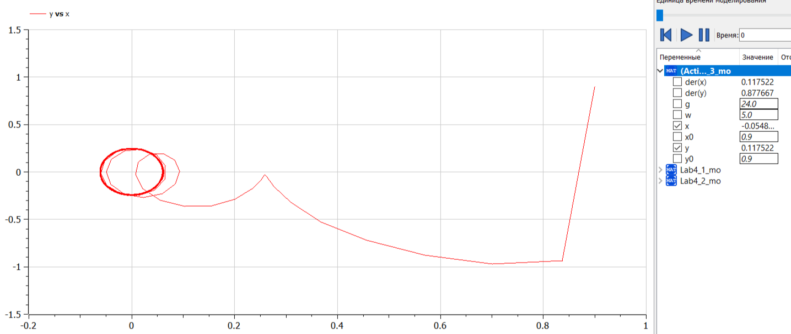{ #fig:013 width=70% }

# Выводы

В ходе выполнения лабораторной работы были построены решения уравнения гармонического осциллятора и фазовые портреты гармонических колебаний без затухания, с затуханием и при действии внешней силы на языках Julia и Open Modelica.

# Список литературы. Библиография

[1] Документация по Julia: https://docs.julialang.org/en/v1/

[2] Документация по OpenModelica: https://openmodelica.org/

[3] Решение дифференциальных уравнений: https://www.wolframalpha.com/
