---
## Front matter
title: "Отчет по лабораторной работе № 4"
subtitle: "Модель гармонических колебаний"
author: "Хусаинова Динара Айратовна"


## Generic otions
lang: ru-RU
toc-title: "Содержание"

## Bibliography
bibliography: bib/cite.bib
csl: pandoc/csl/gost-r-7-0-5-2008-numeric.csl

## Pdf output format
toc: true # Table of contents
toc-depth: 2
lof: true # List of figures
#lot: true # List of tables
fontsize: 12pt
linestretch: 1.5
papersize: a4
documentclass: scrreprt
## I18n polyglossia
polyglossia-lang:
  name: russian
  options:
	- spelling=modern
	- babelshorthands=true
polyglossia-otherlangs:
  name: english
## I18n babel
babel-lang: russian
babel-otherlangs: english
## Fonts
mainfont: PT Serif
romanfont: PT Serif
sansfont: PT Sans
monofont: PT Mono
mainfontoptions: Ligatures=TeX
romanfontoptions: Ligatures=TeX
sansfontoptions: Ligatures=TeX,Scale=MatchLowercase
monofontoptions: Scale=MatchLowercase,Scale=0.9
## Biblatex
biblatex: true
biblio-style: "gost-numeric"
biblatexoptions:
  - parentracker=true
  - backend=biber
  - hyperref=auto
  - language=auto
  - autolang=other*
  - citestyle=gost-numeric
## Pandoc-crossref LaTeX customization
figureTitle: "Рис."
tableTitle: "Таблица"
listingTitle: "Листинг"
lofTitle: "Список иллюстраций"
lotTitle: "Список таблиц"
lolTitle: "Листинги"
## Misc options
indent: true
header-includes:
  - \usepackage{indentfirst}
  - \usepackage{float} # keep figures where there are in the text
  - \floatplacement{figure}{H} # keep figures where there are in the text
---

# Цель работы

Изучить понятие гармонического осциллятора, построить фазовый портрет и найти решение уравнения гармонического осциллятора.

# Теоретическое введение

- Гармонический осциллятор [1] — система, которая при смещении из положения равновесия испытывает действие возвращающей силы F, пропорциональной смещению x.

- Гармоническое колебание [2] - колебание, в процессе которого величины, характеризующие движение (смещение, скорость, ускорение и др.), изменяются по закону синуса или косинуса (гармоническому закону).

Движение грузика на пружинке, маятника, заряда в электрическом контуре, а также эволюция во времени многих систем в физике, химии, биологии и других науках при определенных предположениях можно описать одним и тем же дифференциальным уравнением, которое в теории колебаний выступает в качестве основной модели. Эта модель называется линейным гармоническим осциллятором.
Уравнение свободных колебаний гармонического осциллятора имеет следующий вид:
$$\ddot{x}+2\gamma\dot{x}+\omega_0^2=0$$

где $x$ - переменная, описывающая состояние системы (смещение грузика, заряд конденсатора и т.д.), $\gamma$ - параметр, характеризующий потери энергии (трение в механической системе, сопротивление в контуре), $\omega_0$ - собственная частота колебаний.
Это уравнение есть линейное однородное дифференциальное  уравнение второго порядка и оно является примером линейной динамической системы.

При отсутствии потерь в системе ( $\gamma=0$ ) получаем уравнение консервативного осциллятора энергия колебания которого сохраняется во времени.
$$\ddot{x}+\omega_0^2x=0$$

Для однозначной разрешимости уравнения второго порядка необходимо задать два начальных условия вида
 
$$
 \begin{cases}
	x(t_0)=x_0
	\\   
	\dot{x(t_0)}=y_0
 \end{cases}
$$

Уравнение второго порядка можно представить в виде системы двух уравнений первого порядка:
$$
 \begin{cases}
	x=y
	\\   
	y=-\omega_0^2x
 \end{cases}
$$

Начальные условия для системы примут вид:
$$
 \begin{cases}
	x(t_0)=x_0
	\\   
	y(t_0)=y_0
 \end{cases}
$$

Независимые	переменные	$x, y$	определяют	пространство,	в	котором «движется» решение. Это фазовое пространство системы, поскольку оно двумерно будем называть его фазовой плоскостью.

Значение фазовых координат $x, y$ в любой момент времени полностью определяет состояние системы. Решению уравнения движения как функции времени отвечает гладкая кривая в фазовой плоскости. Она называется фазовой траекторией. Если множество различных решений (соответствующих различным 
начальным условиям) изобразить на одной фазовой плоскости, возникает общая картина поведения системы. Такую картину, образованную набором фазовых траекторий, называют фазовым портретом.

# Задачи

1. Разобраться в понятии гармонического осциллятора

2. Ознакомиться с уравнением свободных колебаний гармонического осциллятора

3. Построить фазовый портрет гармонического осциллятора и решение уравнения на языках Julia и Open Modelica гармонического осциллятора для следующих случаев:

- Колебания гармонического осциллятора без затуханий и без действий внешней силы

- Колебания гармонического осциллятора c затуханием и без действий внешней силы

- Колебания гармонического осциллятора c затуханием и под действием внешней силы
# Выполнение лабораторной работы

1. Вариант № 54

Постройте фазовый портрет гармонического осциллятора и решение уравнения
гармонического осциллятора для следующих случаев

Колебания гармонического осциллятора без затуханий и без действий внешней
силы $\ddot{x}+9.9x=0$;


Колебания гармонического осциллятора c затуханием и без действий внешней
силы $\ddot{x}+\dot{13x}+13x=0$


Колебания гармонического осциллятора c затуханием и под действием внешней
силы $\ddot{x}+\dot{24x}+25x=6sin(4t)$

На интервале $t\in [0;48]$ (шаг $0.05$) с начальными условиями $x_0=0.9, y_0=0.9$.

## Решение с помощью программ

### Julia

2. Создадим файлы lab4_1.jl, lab4_2.jl, lab4_3.jl (рис. 1). 

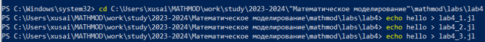{ #fig:001 width=70% }

3. Код программы:

Первый случай:
```
using DifferentialEquations
function lorenz!(du, u, p, t)
	a = p
	du[1] = u[2]
	du[2] = -a*u[1]
end

const x = 0.9
const y = 0.9
u0 = [x,y]

p = (9.9)
tspan = (0.0, 48.0)
prob = ODEProblem(lorenz!, u0, tspan, p)
sol = solve(prob, dtmax = 0.05)

using Plots; gr()

# решение системы уравнений

plot(sol) 
savefig("lab4_1_jl.png")

# фазовый портрет

plot(sol, vars=(2,1))
savefig("lab4_1_jl_port.png")

```

Второй случай:
```
using DifferentialEquations

function lorenz!(du, u, p, t)
    a, b = p
    du[1] = u[2]
    du[2] = -a*du[1] - b*u[1] 
end

const x = 0.9
const y = 0.9
u0 = [x, y]

p = (sqrt(13), 13)
tspan = (0.0, 48.0)
prob = ODEProblem(lorenz!, u0, tspan, p)
sol = solve(prob, dtmax = 0.05)

using Plots; gr()

# решение системы уравнений
plot(sol)
savefig("lab4_2_jl.png")

# фазовый портрет
plot(sol, vars=(2,1))
savefig("lab4_2_jl_port.png")
```

Третий случай:
```
using DifferentialEquations

function lorenz!(du, u, p, t)
    a, b = p
    du[1] = u[2]
    du[2] = -a*du[1] - b*u[1] + 6*sin(4*t)
end

const x = 0.9
const y = 0.9
u0 = [x, y]

p = (sqrt(24), 25)
tspan = (0.0, 48.0)
prob = ODEProblem(lorenz!, u0, tspan, p)
sol = solve(prob, dtmax = 0.05)

using Plots; gr()

#решение системы уравнений
plot(sol)
savefig("lab4_3_jl.png")

#фазовый портрет
plot(sol, vars=(2,1))
savefig("lab4_3_jl_port.png")
```

4. Результат работы "Колебания гармонического осциллятора без затуханий и без действий внешней силы" 

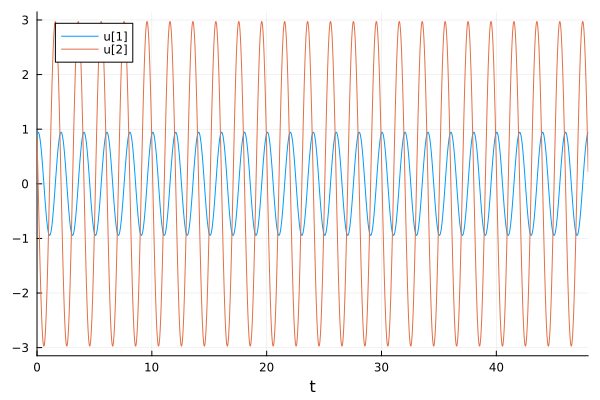{ #fig:002 width=70% }

{ #fig:003 width=70% }


5. Результат работы "Колебания гармонического осциллятора c затуханием и без действий внешней силы" 

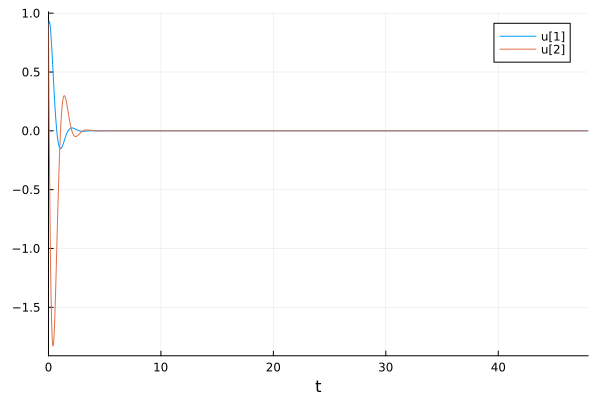{ #fig:004 width=70% }

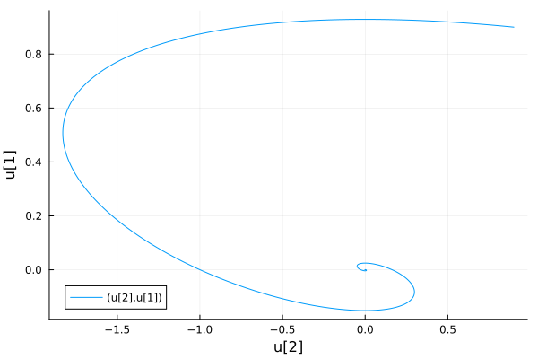{ #fig:005 width=70% }


6. Результат работы "Колебания гармонического осциллятора c затуханием и под действием внешней силы" 

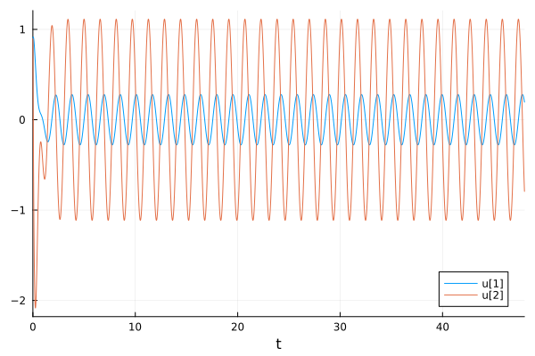{ #fig:006 width=70% }

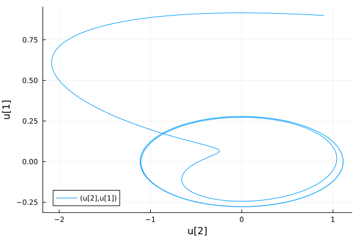{ #fig:007 width=70% }

### OpenModelica

Первый случай
```
model Lab4_1_mo

parameter Real w = sqrt(9.90);  
parameter Real g =0;  

parameter Real x0 = 0.9; 
parameter Real y0 = 0.9; 

Real x(start=x0); 
Real y(start=y0); 

function f 
input Real t ; 
output Real res; 
algorithm  
res := 0; 
end f; 

equation 
der(x) = y; 
der(y) = -w*w*x - g*y + f(time); 

end Lab4_1_mo;

```

Второй случай
```
model Lab4_2_mo
parameter Real w = sqrt(13.00);  
parameter Real g = 13;  

parameter Real x0 = 0.9; 
parameter Real y0 = 0.9; 

Real x(start=x0); 
Real y(start=y0); 


function f 
input Real t ; 
output Real res; 
algorithm  
res := 0; 
end f; 

equation 
der(x) = y; 
der(y) = -w*w*x - g*y + f(time); 

end Lab4_2_mo;

```

Третий случай
```
model Lab4_3_mo

parameter Real w = sqrt(25.0);  
parameter Real g = 24;  

parameter Real x0 = 0.9; 
parameter Real y0 = 0.9; 

Real x(start=x0); 
Real y(start=y0); 

 
function f 
input Real t ; 
output Real res; 
algorithm  
res := 6*sin(4*t);
end f; 

equation 
der(x) = y; 
der(y) = -w*w*x - g*y - f(time); 

end Lab4_3_mo;
```

7. Результат работы "Колебания гармонического осциллятора без затуханий и без действий внешней силы" 

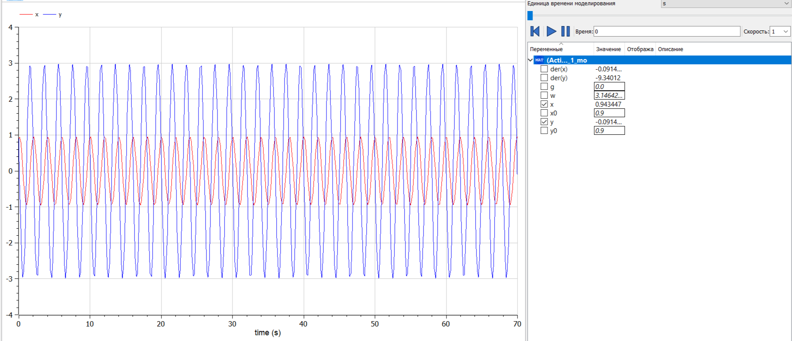{ #fig:008 width=70% }

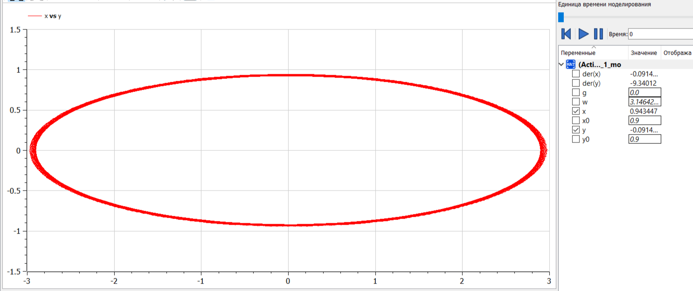{ #fig:009 width=70% }


8. Результат работы "Колебания гармонического осциллятора c затуханием и без действий внешней силы" 

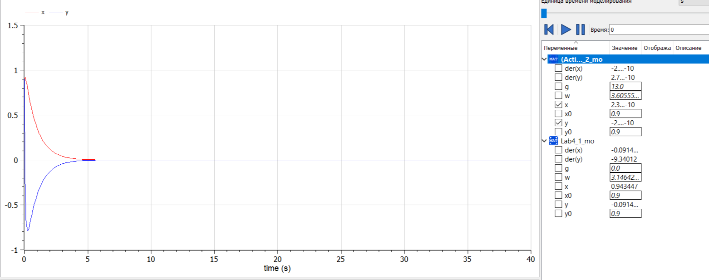{ #fig:010 width=70% }

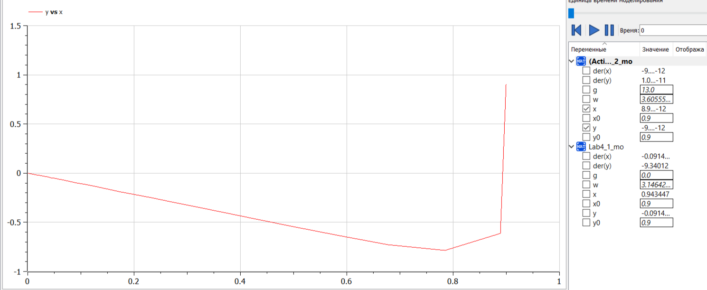{ #fig:011 width=70% }


9. Результат работы "Колебания гармонического осциллятора c затуханием и под действием внешней силы" 

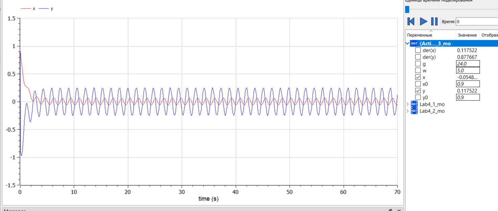{ #fig:012 width=70% }

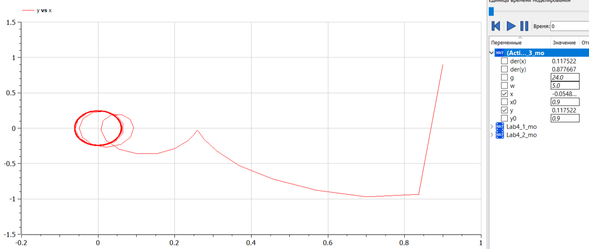{ #fig:013 width=70% }


# Анализ полученных результатов. Сравнение языков.

В итоге проделанной работы мы построили по три модели (включающих в себя два графика) на языках Julia и OpenModelica. Построение моделей колебания на языке OpenModelica занимает меньше строк, чем аналогичное построение на Julia.

# Вывод

В ходе выполнения лабораторной работы были построены решения уравнения гармонического осциллятора и фазовые портреты гармонических колебаний без затухания, с затуханием и при действии внешней силы на языках Julia и Open Modelica.

# Список литературы. Библиография

[1] Документация по Julia: https://docs.julialang.org/en/v1/

[2] Документация по OpenModelica: https://openmodelica.org/

[3] Решение дифференциальных уравнений: https://www.wolframalpha.com/
