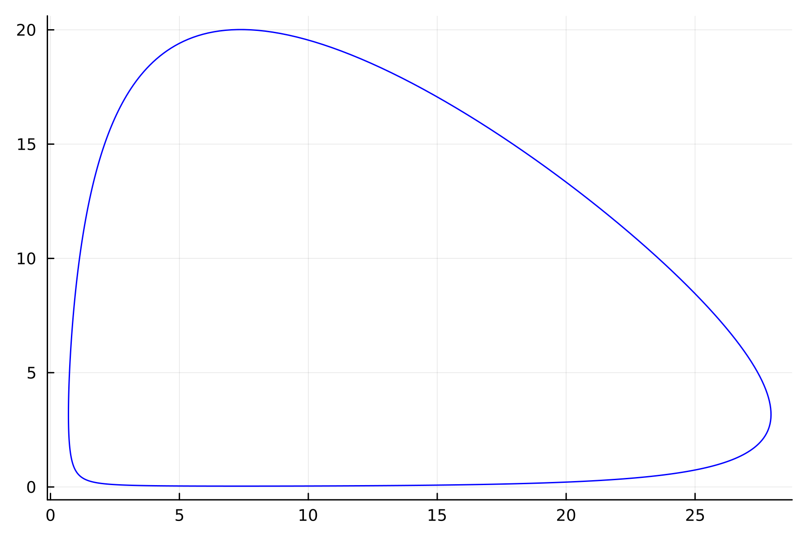

---
## Front matter
lang: ru-RU
title: "Презентация по лабораторной работе №5"
subtitle: "Модель хищник-жертва"
author:
  - Хусаинова Д.А.
institute:
  - Российский университет дружбы народов, Москва, Россия
date: 7 марта 2024

## i18n babel
babel-lang: russian 
babel-otherlangs: english 
mainfont: Arial 
monofont: Courier New 
fontsize: 12pt

## Formatting pdf
toc: false
toc-title: Содержание
slide_level: 2
aspectratio: 169
section-titles: true
theme: metropolis
header-includes:
 - \metroset{progressbar=frametitle,sectionpage=progressbar,numbering=fraction}
 - '\makeatletter'
 - '\beamer@ignorenonframefalse'
 - '\makeatother'
---

# Цель работы

Изучить жесткую модель хищник-жертва и построить эту модель.

# Теоретическое введение

- Модель Лотки—Вольтерры — модель взаимодействия двух видов типа «хищник — жертва», названная в честь её авторов, которые предложили модельные уравнения независимо друг от друга. Такие уравнения можно использовать для моделирования систем «хищник — жертва», «паразит — хозяин», конкуренции и других видов взаимодействия между двумя видами.

# Скорость роста численности жертв уменьшается пропорционально численности хищников

$$
 \begin{cases}
	\frac{dx}{dt} = (-ax(t) + by(t)x(t))
	\\   
	\frac{dy}{dt} = (cy(t) - dy(t)x(t))
 \end{cases}
$$

# Для модели «хищник-жертва»

$$
 \begin{cases}
	\frac{dx}{dt} = -0.13*x(t) + 0.041*y(t)x(t)
	\\   
	\frac{dy}{dt} = 0.31*y(t) -0.042*y(t)x(t)
 \end{cases}
$$
Надо было построить график зависимости численности хищников от численности жертв,а также графики изменения численности хищников и численности жертв при
следующих начальных условиях: $x_0=7, y_0=20$. Найти стационарное
состояние системы.

# Julia. График численности хищников от численности жертв

{ #fig:001 width=70% }

# Julia. График численности жертв и хищников от времени 

{ #fig:002 width=70% }

# Julia. Стационарное состояние

{ #fig:003 width=70% }

# OpenModelica. График численности хищников от численности жертв

{ #fig:001 width=70% }

# OpenModelica. График численности жертв и хищников от времени 

{ #fig:002 width=70% }

# OpenModelica. Стационарное состояние

{ #fig:003 width=70% }

# Выводы

Изучили жесткую модель хищник-жертва и построить эту модель.

# Список литературы. Библиография

[1] Документация по Julia: https://docs.julialang.org/en/v1/

[2] Документация по OpenModelica: https://openmodelica.org/

[3] Решение дифференциальных уравнений: https://www.wolframalpha.com/

[4] Модель Лотки—Вольтерры: https://math-it.petrsu.ru/users/semenova/MathECO/Lections/Lotka_Volterra.pdf