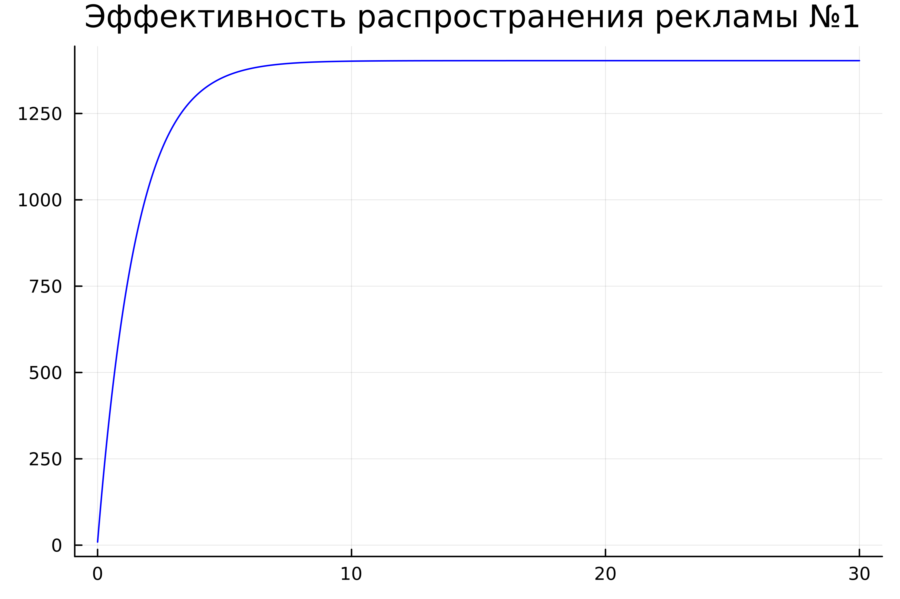
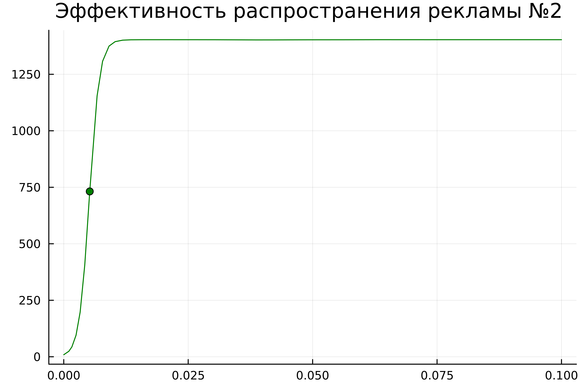
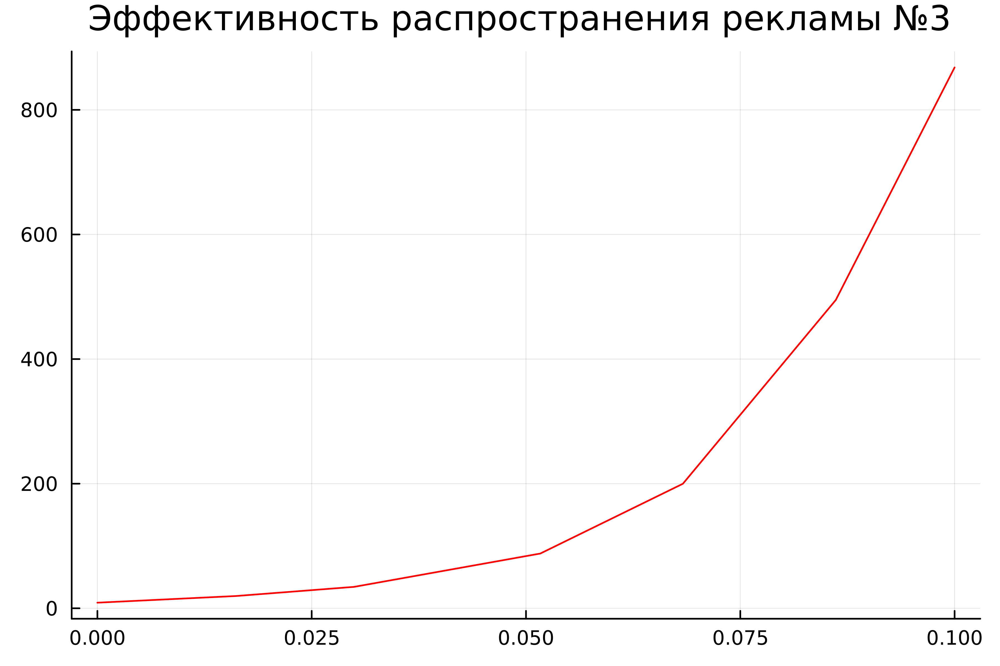
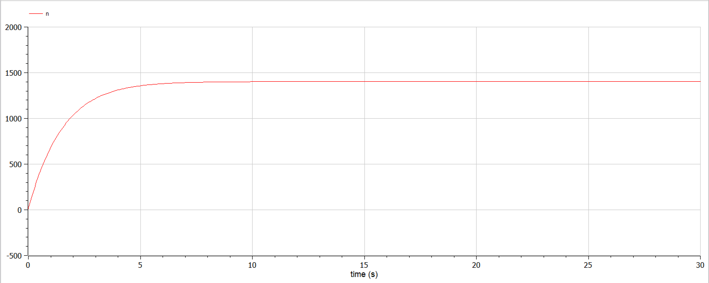
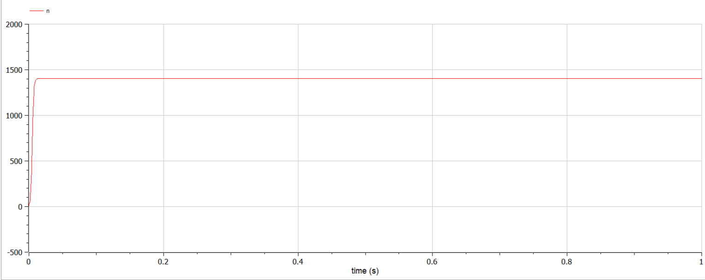
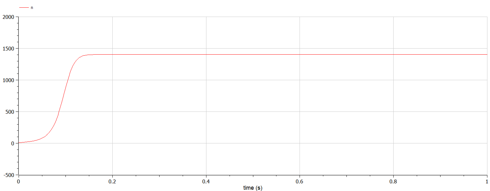

---
## Front matter
lang: ru-RU
title: "Презентация по лабораторной работе №7"
subtitle: "Эффективность рекламы"
author:
  - Хусаинова Д.А.
institute:
  - Российский университет дружбы народов, Москва, Россия
date: 18 марта 2024

## i18n babel
babel-lang: russian 
babel-otherlangs: english 
mainfont: Arial 
monofont: Courier New 
fontsize: 12pt

## Formatting pdf
toc: false
toc-title: Содержание
slide_level: 2
aspectratio: 169
section-titles: true
theme: metropolis
header-includes:
 - \metroset{progressbar=frametitle,sectionpage=progressbar,numbering=fraction}
 - '\makeatletter'
 - '\beamer@ignorenonframefalse'
 - '\makeatother'
---

# Цель работы

Изучить и построить модель эффективности рекламы.

# Теоретическое введение. Величины

$\frac{dn}{dt}$ - скорость изменения со временем числа потребителей, узнавших о товаре и готовых его купить,

$t$ - время, прошедшее с начала рекламной кампании,

$N$ - общее число потенциальных платежеспособных покупателей,

$n(t)$ - число  уже информированных клиентов.

# Распространение информации

$\alpha _1(t)(N-n(t))$, где $\alpha _1>0$ -  характеризует интенсивность рекламной кампании

Помимо этого, узнавшие о товаре потребители также распространяют полученную информацию среди потенциальных покупателей, не знающих о нем (в этом случае работает т.н. сарафанное радио). Этот вклад в рекламу описывается величиной  $\alpha _2(t)n(t)(N-n(t))$. Эта величина увеличивается с увеличением потребителей узнавших о товаре.

# Математическая модель

Математическая модель распространения рекламы описывается уравнением:

$$\frac{dn}{dt} = (\alpha _1(t) + \alpha _2(t)n(t))(N-n(t))$$

# Модель типа модели Мальтуса

При $\alpha _1(t) >> \alpha _2(t)$ получается модель типа модели Мальтуса, решение которой имеет вид 

{ #fig:0001 width=70% height=70% }

# Уравнение логистической кривой

В обратном случае $\alpha _1(t) << \alpha _2(t)$ получаем уравнение логистической кривой

{ #fig:0002 width=70% height=70% }

# Вариант 54 

Постройте график распространения рекламы, математическая модель которой описывается следующим уравнением:

1.	$\frac{dn}{dt} = (0.64+0.00004n(t))(N-n(t))$
2.	$\frac{dn}{dt} = (0.00007+0.7n(t))(N-n(t))$
3.	$\frac{dn}{dt} = (0.4+0.3\sin{(2t)} n(t))(N-n(t))$

При этом объем аудитории $N = 1403$, в начальный момент о товаре знает 9 человек.

Для случая 2 определите в какой момент времени скорость распространения рекламы будет иметь максимальное значение.

# Julia. Первый случай $\frac{dn}{dt} = (0.64+0.00004n(t))(N-n(t))$ 

{ #fig:001 width=70% }

# Julia. Второй случай $\frac{dn}{dt} = (0.00007+0.7n(t))(N-n(t))$

{ #fig:002 width=70% }

# Julia. Третий случай $\frac{dn}{dt} = (0.4+0.3\sin{(2t)} n(t))(N-n(t))$

{ #fig:002 width=70% }

# OpenModelica. Первый случай $\frac{dn}{dt} = (0.64+0.00004n(t))(N-n(t))$ 

{ #fig:001 width=70% }

# OpenModelica. Второй случай $\frac{dn}{dt} = (0.00007+0.7n(t))(N-n(t))$

{ #fig:002 width=70% }

# OpenModelica. Третий случай $\frac{dn}{dt} = (0.4+0.3\sin{(2t)} n(t))(N-n(t))$

{ #fig:003 width=70% }

# Вывод

В ходе выполнения лабораторной работы была изучена модель эффективности рекламы и в дальнейшем построена модель на языках Julia и Open Modelica.

# Список литературы. Библиография.

[1] Документация по Julia: https://docs.julialang.org/en/v1/

[2] Документация по OpenModelica: https://openmodelica.org/

[3] Решение дифференциальных уравнений: https://www.wolframalpha.com/

[4] Мальтузианская модель роста: https://www.stolaf.edu//people/mckelvey/envision.dir/malthus.html