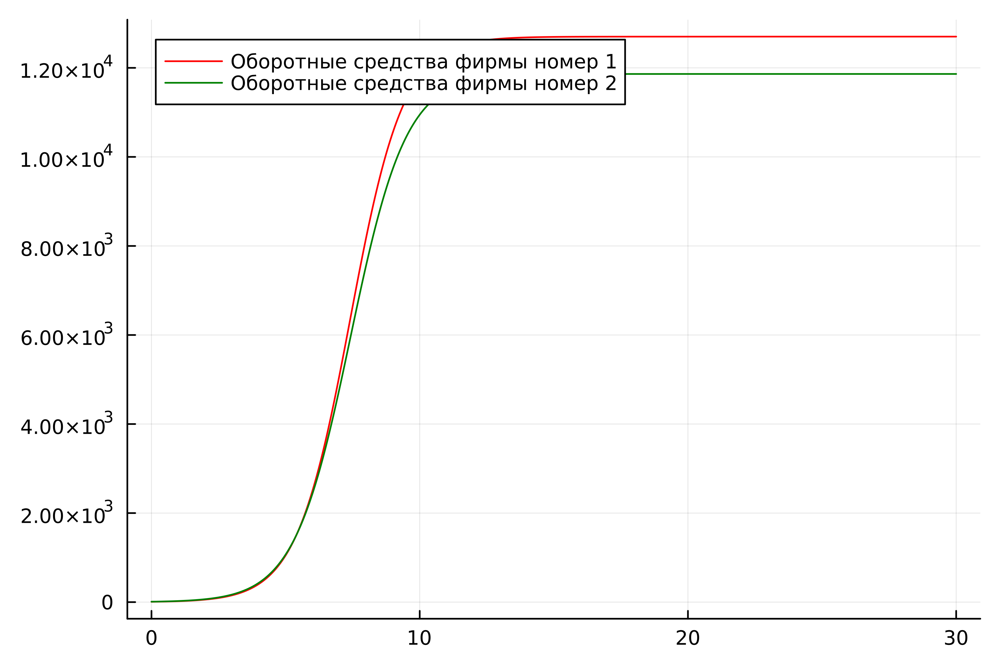
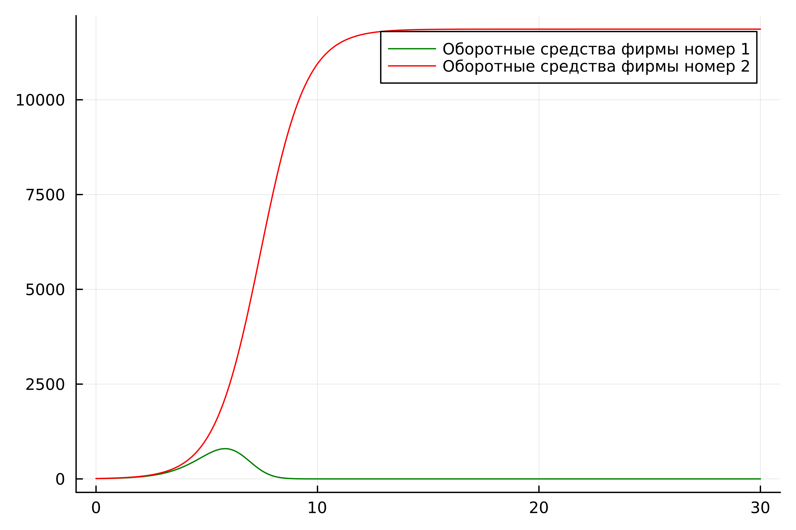
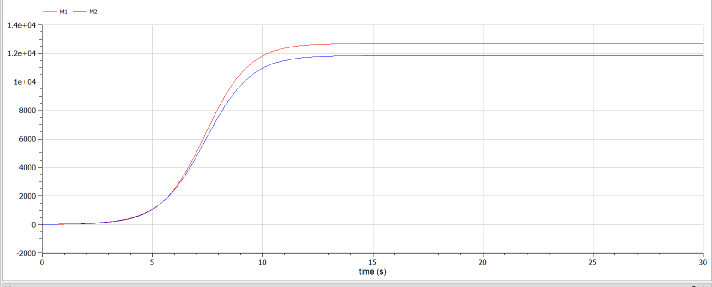
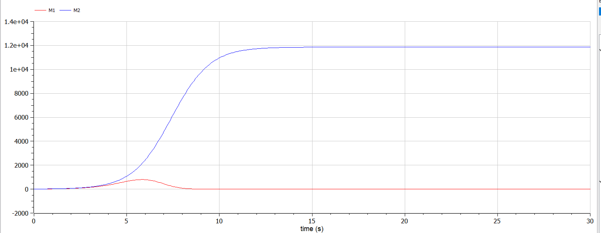

---
## Front matter
lang: ru-RU
title: "Презентация по лабораторной работе №8"
subtitle: "Модель конкуренции двух фирм"
author:
  - Хусаинова Д.А.
institute:
  - Российский университет дружбы народов, Москва, Россия
date: 30 марта 2024

## i18n babel
babel-lang: russian 
babel-otherlangs: english 
mainfont: Arial 
monofont: Courier New 
fontsize: 12pt

## Formatting pdf
toc: false
toc-title: Содержание
slide_level: 2
aspectratio: 169
section-titles: true
theme: metropolis
header-includes:
 - \metroset{progressbar=frametitle,sectionpage=progressbar,numbering=fraction}
 - '\makeatletter'
 - '\beamer@ignorenonframefalse'
 - '\makeatother'
---

# Цель работы

Изучить и построить модель конкуренции двух фирм.

# Теоретическое введение 1/7

Введем обозначения: 

$N$ - число потребителей производимого продукта. 

$S$ – доходы потребителей данного продукта. Считаем, что доходы всех потребителей одинаковы. Это предположение справедливо, если речь идет об одной рыночной нише, т.е. производимый продукт ориентирован на определенный слой населения. 

$M$ – оборотные средства предприятия 

$\tau$ - длительность производственного цикла

$p$ - рыночная цена товара 

# Теоретическое введение 2/7

$\widetilde{p}$ - себестоимость продукта, то есть переменные издержки на производство единицы продукции

$\delta$ - доля оборотных средств, идущая на покрытие переменных издержек

$k$ - постоянные издержки, которые не зависят от количества выпускаемой продукции

$Q(S/p)$ – функция спроса, зависящая от отношения дохода $S$ к цене $p$. Она равна количеству продукта, потребляемого одним потребителем в единицу времени.

# Теоретическое введение 3/7

Функцию спроса товаров долговременного использования часто представляют в простейшей форме: 

$$Q = q - k\frac{p}{S} = q(1 - \frac{p}{p_{cr}})$$

где $q$ – максимальная потребность одного человека в продукте в единицу времени.

# Теоретическое введение 4/7. Случай 1. Вариант 54

$$\frac{dM_1}{d\Theta} = M_1 - \frac{b}{c_1}M_1 M_2 - \frac{a1}{c1} M_1^2 $$

$$ \frac{dM_2}{d\Theta} = \frac{c_2}{c_1} M_2 - \frac{b}{c_1} M_1 M_2 - \frac{a_2}{c_1} M_2^2$$

# Теоретическое введение 5/7. Случай 1. Вариант 54

где 
$$ a_1 = \frac{p_{cr}}{\tau_1^2 \widetilde{p}_1^2 Nq } $$
$$ a_2 = \frac{p_{cr}}{\tau_2^2 \widetilde{p}_2^2 Nq } $$ 
$$ b = \frac{p_{cr}}{\tau_1^2 \widetilde{p}_1^2 \tau_2^2 \widetilde{p}_2^2 Nq} $$
$$ c_1 = \frac{p_{cr} - \widetilde{p}_1}{\tau_1 \widetilde{p}_1} $$
$$ c_2 = \frac{p_{cr} - \widetilde{p}_2}{\tau_2 \widetilde{p}_2} $$

также введена нормировка $t = c_1 \Theta$

# Теоретическое введение 6/7. Случай 2. Вариант 54

$$\frac{dM_1}{d\Theta} = M_1 - (\frac{b}{c_1} + 0.00044)M_1 M_2 - \frac{a1}{c1} M_1^2 $$

$$ \frac{dM_2}{d\Theta} = \frac{c_2}{c_1} M_2 - \frac{b}{c_1} M_1 M_2 - \frac{a_2}{c_1} M_2^2$$

# Теоретическое введение 7/7. Вариант 54

Для обоих случаев рассмотрим задачу со следующими начальными условиями и параметрами

$$ M_0^1=7.7 ,\: M_0^2=9.7 $$
$$ p_{cr}=47 ,\: N=50 ,\: q=1 $$
$$ \tau_1=33 ,\: \tau_2=27 $$
$$ \widetilde{p}_1=9.7 ,\: \widetilde{p}_2=11.7 $$

# Julia. Первый случай 

{ #fig:001 width=70% }

# Julia. Второй случай 

{ #fig:002 width=70% }

# OpenModelica. Первый случай 

{ #fig:001 width=70% }

# OpenModelica. Второй случай 

{ #fig:002 width=70% }

# Вывод

В ходе выполнения лабораторной работы была изучена модель конкуренции двух фирм и в дальнейшем построена модель на языках Julia и Modelica.

# Список литературы. Библиография.

[1] Документация по Julia: https://docs.julialang.org/en/v1/

[2] Документация по OpenModelica: https://openmodelica.org/

[3] Решение дифференциальных уравнений: https://www.wolframalpha.com/

[4] Мальтузианская модель роста: https://www.stolaf.edu//people/mckelvey/envision.dir/malthus.html

[5] Математические модели конкурентной среды: https://dspace.spbu.ru/bitstream/11701/12019/1/Gorynya_2018.pdf

[6] Разработка математических моделей конкурентных процессов: https://www.academia.edu/9284004/Наумейко_РАЗРАБОТКА_МАТЕМАТИЧЕСКОЙ_МОДЕЛИ_КОНКУРЕНТНЫХ_ПРОЦЕССОВ 
